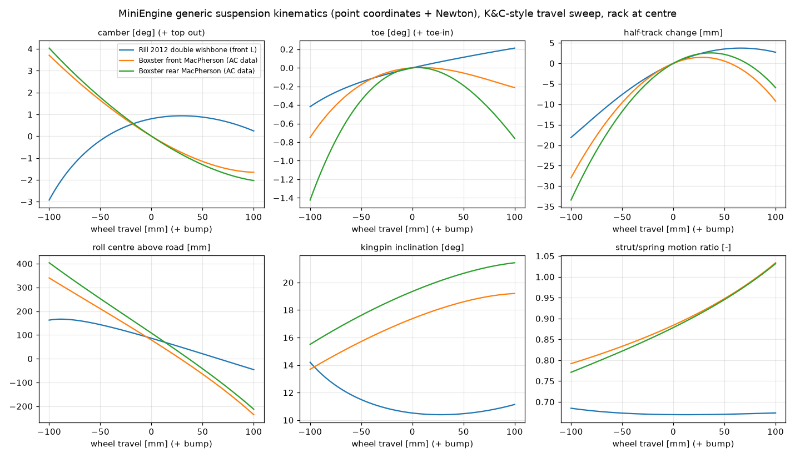

# 通用实时悬挂模块（engine/suspension）

日期：2026-10-02。状态：已实现，`miniengine_suspension_tests` 全部通过；**尚未接入整车（Jolt）**。

标注约定：**[已验证]** = 本仓库测试或独立计算核对过；**[文献]** = 读过原文的来源；**[未核对]** = 只看过摘要/标题，或是我自己的假设，用前需要标定或核实。

---

## 0. 结论

| 项 | 结果 |
|---|---|
| 架构 | 一套代码：硬点 + 刚体（点集）+ 滑柱 + 衬套 + 力元。麦弗逊、双叉臂只是两份配置（`MakeMacPherson` / `MakeDoubleWishbone` 只填点名），多连杆同样写成点和刚体即可 |
| 运动学 | 点坐标 + 距离约束，Newton 在线求解，不查表；硬点改了立即生效 |
| 精度 | Rill 书中双叉臂主销内倾/后倾/拖距/磨胎半径与书一致到 1e-4° / 1e-7 m；三套悬挂的外倾、前束、轮心与独立闭式解一致到 1e-6° / 1e-8 m **[已验证]** |
| 收敛 | 1 kHz、±80 mm @3 Hz + 齿条 ±30 mm 的激烈工况：平均 1.7–1.8 次修正/帧，最多 2 次，平均 1.004 次 LU/帧 **[已验证]** |
| 耗时（i9-14900HX，Release，单线程） | 单角完整一步（运动学 + K&C 输出 + 减振器/摩擦 + 反力）约 4 µs；其中求解 1.5 µs；带衬套的弹性运动学额外约 20 µs **[已验证]** |
| 摩擦 | Stribeck / LuGre / 侧向力相关 LuGre，可插拔；顶座双传力路径；粘滑能自然出现 **[已验证]**。参数随侧向力变化的函数形式是假设 **[未核对]** |

K&C 行程扫描曲线（`MINIENGINE_SUSPENSION_CSV=<目录>` 运行测试即可导出 CSV）：



---

## 1. 文献汇总

| 来源 | 状态 | 用到了什么 |
|---|---|---|
| Archut & Corves, *Multibody Syst. Dyn.* 63 (2024) | [文献] 全文读过 | 衬套刚度量级 1e5–1e7 N/m；刚性方程用线性隐式 LSRT2，1 ms 误差约 1%，必须每步重新线性化。本模块没有走"衬套刚体动力学"这条路，而是准静态柔度（见第 4 节），所以不需要刚性积分器 |
| Uchida, PhD thesis, Waterloo (2011) | [文献] | 嵌入法 `BᵀMB q̈ᵢ = BᵀF − BᵀM(Ḃq̇ᵢ + Ċ)`；三角化/闭式解思路；双叉臂硬点数据 |
| Rill, *Road Vehicle Dynamics*, CRC (2012) | [文献] | 双叉臂闭式运动学和书中数据（本模块的主要基准）；转向几何定义（主销内倾、后倾、拖距、磨胎半径）；Jourdain 原理；点对点力元的广义力；扫频和一阶谐波法；1/4 车最优阻尼；抗点头/抗下蹲的悬挂力投影 |
| Pacejka, *Tyre and Vehicle Dynamics*, 2nd ed. (2006) | [文献] | 侧倾角、载荷转移、侧倾/柔度转向公式（整车层用） |
| 我推导的麦弗逊闭式解（参考文档 2C 节） | [已验证] 与 Newton 一致到 1e-14 | 作为本模块麦弗逊测试的独立基准 |
| Attia（点坐标法；麦弗逊算法的论文是 2004 年 KSIAM，2003 年那篇讲平面机构） | [未核对] 只看到摘要 | 摘要确认：用连杆和铰点上各点的直角坐标，约束多为线性或二次。本模块的距离约束即此类形式，但具体公式是我按标准自然坐标法写的，不是照抄原文 |
| Nikravesh, *Planar/Spatial Multibody Dynamics*（点坐标章节） | [未核对] 未读 | 未直接使用 |
| Magri et al. 2024，"A Comprehensive Method for Computing Suspension Elasto-kinematics With Non-linear Compliance" | [未核对] PDF 无法访问，只有摘要 | 摘要确认：准静态方法，面向实时，克服基于叠加原理（查表 + 线性叠加）的局限。本模块的第 4 节是我自己的 KKT 牛顿法，目标一致，但**不是**他们的算法 |
| Deubel, Meinck & Prokop, *Tribology International* 215 (2026), 2025-11 在线，DOI 10.1016/j.triboint.2025.111328（你给的作者名 "Schubert" 与检索结果不符） | [未核对] 只有摘要 | 摘要确认：扩展 LuGre；Stribeck 参数写成侧向力的函数；侧向力和速度相互影响。**具体方程未拿到**，本模块的二次函数形式是假设 |
| Choi, Yoo, Lee, Yoon, *Int. J. Vehicle Design* (2000)，悬挂复合铰 | [未核对] 只有摘要 | 摘要确认：质量小但运动学关键的杆件按无质量连杆处理。本模块所有杆件都无质量（只靠距离约束），轮架/车轮质量只进入沿行程的等效质量 |

---

## 2. 运动学数学推导

### 2.1 坐标与约束

坐标系：x 前、y 左、z 上（Rill），单位 m。右侧车轮由左侧镜像得到（`MirrorToRight`），输出的外倾、前束符号两侧相同。

未知量 q = [各运动点的坐标 p_i（每点 3 个）, 各滑柱滑移量 s_j]。点分三类：`Chassis`（固定）、`Moving`（未知）、`Rack`（车身点，沿齿条轴随齿条行程 u 平移：p = p⁰ + u·e_rack）。

刚体 = 点集。编译时自动生成距离约束：选基准三角形（第一个点、离它最远的点、与这两点围成面积最大的点），基准三边各一条，其余每点到三个基准点各一条；共 3n−6 条。两端都不是未知量的约束跳过。无质量连杆（拉杆、摆臂）也是刚体，按 Choi 的思路不赋质量。

| 约束 | 方程 Φ | 行数 |
|---|---|---|
| 距离（刚体、连杆、转动副 + 球铰） | ½(\|p_a − p_b\|² − L²) | 1 |
| 滑柱（麦弗逊：顶座 T 在固定于轮架的直线 b→c 上） | p_a − p_b − s·(p_c − p_b)/L_bc | 3（多 1 个未知量 s） |
| 行程驱动 | n_z·(p_W − p_W⁰) − z | 1 |

写成 ½(…) 是为了让梯度就是 (p_a − p_b)。

各悬挂的约束数（全部方阵，由编译检查）：

- **双叉臂**：未知点 = 下球铰、上球铰、拉杆外点、轮心、轮轴点、弹簧座 → 18 个未知量。约束：轮架 9 + 下摆臂（含弹簧座）5 + 上摆臂 2 + 拉杆 1 + 行程 1 = 18。下摆臂的"转动副 + 球铰"就是下球铰到两个车身铰点的两条距离。
- **麦弗逊**（AC 数据：滑柱轴线过下球铰）：轮架 5 点 + s → 16；约束：轮架 9 + 下摆臂 2 + 滑柱 3 + 拉杆 1 + 行程 1 = 16。滑柱轴线不过下球铰时：19 = 12 + 2 + 3 + 1 + 1。
- 顶座是车身上的点 T，滑柱约束只限制 T 在轴线上，所以顶座天然是球铰，活塞杆可以绕轴转。

### 2.2 雅可比 Φ_q 与输入导数

| 约束 | 对 p_a | 对 p_b | 对 p_c | 对 s | ∂/∂z | ∂/∂u（点为 Rack 时） |
|---|---|---|---|---|---|---|
| 距离 | (p_a−p_b)ᵀ | −(p_a−p_b)ᵀ | | | 0 | 该点梯度 · e_rack |
| 滑柱 | I | −(1−s/L) I | −(s/L) I | −(p_c−p_b)/L | 0 | 同上 |
| 行程 | n_zᵀ（对轮心） | | | | −1 | 0 |

### 2.3 速度与加速度

```
速度：Φ_q q̇ = −Φ_z ż − Φ_u u̇   ⇒   q̇ = q_z ż + q_u u̇,   q_z = −Φ_q⁻¹ Φ_z,   q_u = −Φ_q⁻¹ Φ_u
加速度：Φ_q q̈ = γ
  距离：γ = −|ṗ_a − ṗ_b|² − (p_a − p_b)·(a_a^known − a_b^known)
  滑柱：γ = 2 ṡ (ṗ_c − ṗ_b)/L − [a_a^known − (1−s/L) a_b^known − (s/L) a_c^known]
  行程：γ = z̈
  （"known" 指不是未知量的点的加速度，只有齿条点 = e_rack ü）
```

q_z、q_u 就是 Rill 的偏速度（Jourdain 原理中的 ∂v/∂ż）。有了它们，力投影 `Q·q_z`（沿行程的广义力）、等效质量 `Σ m_i |∂p_i/∂z|²` 都是现成的。测试用有限差分核对了 q_z、q_u、q̈ **[已验证]**。

### 2.4 求解（每帧）

1. **预测**：q = q_prev + q_z Δz + q_u Δu（用上一帧的灵敏度）。残差是 O(Δ²)。
2. **弦迭代**：用上一帧解处的 LU（已为灵敏度分解好）做修正，不重新分解。只要每步残差下降 10 倍以上就继续。
3. 弦迭代变慢时切换到**完整 Newton**（新雅可比 + LU），带回溯线搜索（步长折半，最多 6 次）。
4. 收敛判据：max|Φ| < 1e-10（距离行 ≈ L·δ，即位置误差不到 1 nm）。
5. 在解处重新分解一次 LU → 更新 q_z、q_u（也是下一帧弦迭代用的矩阵）。
6. **失败处理**：
   - **奇异**：主元比 < 1e-9（拉杆拉直、摆臂共线），判为失败。
   - **镜像装配**：轮架上最大四面体的定向体积变号，判为失败。
   - **不收敛**：判为失败。
   - 失败时把剩余的输入增量折半重试（最多 8 次），走到能走到的最远处：状态为 `Clamped`。完全走不动时为 `Failed`，状态保持上一帧不变。**任何情况下都不会留下非法状态。** 测试：请求 600 mm 上跳 → 停在可达极限，残差仍 < 1e-10，再回到 0 时恢复到设计位置 **[已验证]**。

### 2.5 输出量

- 车轮轴 a = (轮轴点 − 轮心)/0.1 m；外倾 = −asin(a_z)（上沿外倾为正）；前束 = atan2(a_x, side·a_y)（toe-in 为正）。
- 外倾增益、bump steer、转向传动比 = 由 ȧ = ω × a 解析求得；轮架角速度 ω 用轮架各点速度最小二乘：
  `(Σ(|r|² I − r rᵀ)) ω = Σ r × (v_k − v_0)`。
- 接地点 P = W + r·ρ，ρ = 垂直于车轮轴、指向下方的单位向量（与 Rill 一致）。
- **主销轴** = 齿条运动下轮架的瞬时螺旋轴：轴点 = W + (ω × v_W)/|ω|²。求这个灵敏度时固定的是 `steeringAxisReference` 点的高度：预设固定下球铰，结果就是教科书的主销（双叉臂为两球铰连线，麦弗逊为下球铰到顶座）；留空则固定轮心高度，即 K&C 台架"车轮垫高度不变"测到的虚拟主销。多连杆没有实铰主销，用同一算法得到虚拟主销。
- 内倾 σ = atan2(−side·e_y, e_z)，后倾 ν = atan2(−e_x, e_z)；主销与路面交点 S，r_SP = P − S，拖距 c = −r_SP·x̂，磨胎半径 s = r_SP·outward（Rill 5.100–5.103 的符号）。
- 半轮距变化、轴距变化：接地点相对设计位置的位移。
- 前视瞬心：过轮心 W、垂直于其速度的直线，与过轮架上 P 点、垂直于 P 点速度的直线，两线在 yz 平面的交点。侧倾中心高 = 从 P 经瞬心连线到车辆中面的交点、**相对路面**的高度（假设左右对称）。测试核对 `h = (t/2)·d(半轮距)/dz` **[已验证]**。
- 侧视：接地点轨迹角 atan(dx_P/dz)（外置制动器抗点头）、轮心轨迹角 atan(dx_W/dz)（内置制动器 / 驱动轴抗下蹲）；侧视瞬心同理。
- 安装比：力元长度 ℓ，motion ratio = −dℓ/dz。
- 等效质量 = Σ m_i |∂p_i/∂z|²（刚体质量平均分到它的运动点上，这是近似）。

---

## 3. 静力学（反力、侧向力、齿条力）

无质量机构的准静态平衡：`Φ_qᵀ μ = Q`。

- **轮胎载荷分配**：接地点上的力 F 和力矩 M，按最小二乘范数分到轮架各点：`f_k = λ + μ × (p_k − P)`，(λ, μ) 由合力、合力矩两组方程（6×6）求出。对刚体而言，它和原载荷做的虚功相同。
- **力元**：沿两点连线，压缩为正，推开两端。
- **求解**：用运动学已有的 LU 做一次转置求解（不再分解）。
- **约束力**：作用在任一点上的约束力 = −μ_i ∂Φ_i/∂p。车身点（含齿条点）上的约束力就是传给车身的载荷。
- **滑柱侧向力**：滑柱行的乘子 μ（3 维）给出顶座受力 −μ，取其垂直于滑柱轴线的分量，就是侧向载荷（滑柱的 s 行平衡保证轴向分量为零，轴向力全部经弹簧/减振器传递）。
- **沿行程的广义力** = Q·q_z（虚功），**齿条力** = 齿条点所受约束力在齿条轴上的投影。
- 测试：
  - 整个机构的力和力矩平衡到 1e-6。
  - 沿行程的广义力等于载荷的虚功。
  - 制动 4 kN 时，Boxster 前滑柱侧向载荷从 550 N 升到 1560 N。

  以上均 **[已验证]**。

活塞/导向套的接触法向力（把杆当双支点梁，由顶座侧向力推算）**没有做**：需要导向套和活塞的位置数据，而且 Deubel 等的"侧向力"具体指哪个量没能核实。摩擦目前直接用顶座侧向载荷作为法向输入 **[未核对]**。

## 4. 弹性运动学（准静态，非线性衬套）

- 以 `ModelMode::Compliant` 编译：衬套所在的车身点变成未知量，摆臂三角形自动补上第三条边。
- 衬套：每个点有自己的局部坐标轴，每轴一条非线性力律 F(δ)（`Curve`：线性、立方渐进、限位、单调三次表）。
- 平衡方程（不做叠加）：
```
∇V(q) − Q(q) + Φ_qᵀ μ = 0,   Φ(q) = 0
V：衬套势能，∇V = R f(Rᵀ(p − anchor))，∇²V = R diag(f′) Rᵀ
KKT 牛顿：[H Φ_qᵀ; Φ_q 0][Δq; Δμ] = −[残差; Φ]
H = ∇²V + Σ μ_i ∇²Φ_i（距离行：μ[I −I; −I I]；滑柱行：s 与 p_b、p_c 的交叉项 ±μ/L）
```
- **载荷对 q 的依赖（随动力效应）没有放进 H**，所以是拟牛顿；实测收敛良好。
- 衬套只有平移刚度：点模型无法表达衬套的扭转刚度（要用点表达，需在摆臂上多放偏置点，**未做**）。
- 测试：
  - 近刚性衬套（1e10 N/m）下，3 kN 侧向力引起的前束变化 1e-6 rad。
  - 线性衬套下力加倍、前束变化也加倍（误差 2% 内）。
  - 渐进衬套下明显小于正比。
  - 量级：Rill 双叉臂四个铰点用线性衬套（径向 4e6、轴向 1e6 N/m）时，侧向力柔度转向 −0.054°/kN。

  以上均 **[已验证]**。衬套刚度参数本身是示例值。

## 5. 减振器、摩擦与顶座

- **摩擦模型（可插拔，`FrictionModel`）**：`NoFriction`、`StribeckFriction`（静态，tanh 正则化，零速时无法保持力）、`LuGreFriction`（Canudas de Wit 1995 **[文献：标准形式]**）：
```
ż = v − σ0 |v| z / g(v, N),   F = σ0 z + σ1 ż + σ2 v
g(v, N) = F_c(N) + (F_s(N) − F_c(N)) exp(−|v/v_s|^δ)
F_c(N), F_s(N) = c0 + c1|N| + c2 N²      ← 函数形式是假设 [未核对]
```
  - z 用后向 Euler 积分（给定 v 时 ż 对 z 是线性的，有闭式），任意步长都稳定。
  - N 下降时把 z 夹在 |z| ≤ g/σ0 以内：这是我的简单处理，不来自文献 **[未核对]**。
  - 测试：稳态等于 Stribeck 曲线；静止时保持力（静摩擦）；侧向力提高脱离力 **[已验证]**。
- **双叉臂**：用普通 LuGre（c1 = c2 = 0）即可，不需要侧向力。
- **StrutUnit（两条传力路径并联）**：
  - 弹簧路径：螺旋弹簧与弹簧座橡胶串联，每步用一维 Newton 分配变形。测试：30 kN/m 与 120 kN/m 串联 = 24 kN/m **[已验证]**。
  - 减振器路径：液压阻尼 F_D(v_p)、摩擦 F_f(v_p, N) 和缓冲块并联，再与顶座杆橡胶 (k, c) 串联。未知量是橡胶的变形速度 w，活塞速度 v_p = v − w；隐式求解 `F_rubber(x + w dt) + c w = F_D + F_f + F_bump`，用带括号的 Newton 法。
  - 缓冲块放在减振器路径上，这是建模选择。
- **粘滑**：慢速（2 mm/s）压缩、顶座较软（1.5e5 N/m）、F_s > F_c 时，杆力呈锯齿：粘住时蠕动约 0.2 mm/s，力爬升到约 270 N 后滑移（活塞速度瞬间约 140 mm/s），力跌到约 130 N，4 s 内 6 次。F_s = F_c 时为 0 次 **[已验证]**。
  - 峰值低于设定的 F_s = 400 N，这是 LuGre 预滑移蠕动的固有特性，不是 bug。
- **侧向力的耦合**：每步用上一步反力算出的侧向力（1 ms 滞后），避免把摩擦和静力学耦合成一个隐式系统。这是实时化的取舍。

## 6. 代码结构

```
engine/suspension/                 （库 engine_suspension，只依赖 glm，双精度）
  suspension_math.*        DenseMatrix、DenseLu（部分主元、转置求解、主元比）
  suspension_curves.*      Curve：线性 / 立方渐进 / 限位 / 单调三次表，带导数
  suspension_model.*       SuspensionDefinition（点、刚体、滑柱、衬套、力元）→ Compile → Model（约束行）
                           MakeDoubleWishbone / MakeMacPherson / MirrorToRight（只是配置）
  suspension_kinematics.*  Φ、Φ_q、Φ_z、Φ_u；Kinematics（预测 + 弦/Newton + 折半 + 灵敏度 + 加速度）；
                           ComputeOutputs（K&C 量）
  suspension_statics.*     DistributeLoad、SolveReactions（转置求解）、Compliance（KKT）
  suspension_friction.*    FrictionModel：NoFriction / Stribeck / LuGre（含侧向力相关参数）
  suspension_strut.*       StrutUnit：弹簧路径 + 减振器路径 + 顶座双橡胶
  suspension_corner.*      SuspensionCorner::Step：每步依次跑运动学 → 输出 → 减振器 → 反力 → 侧向力（可选柔度）
tests/suspension_tests.cpp         17 项测试（含计时）+ CSV 导出
tools/suspension_reference/        Python 闭式解与基准数据生成（reference_curves.py）
```

整车接入（未做）：车辆模型持有每个角的行程坐标 z_i，以 `travelForce` + 轮胎垂向力（经接地点虚功已包含在 load 里）+ 防倾杆为外力，以 `effectiveMass` 积分；Jolt 的射线轮改由 `geometry.contactPoint` / `spinAxis` 驱动。坐标需要从 Jolt 的 y 向上转换过来。

## 7. 验证方法

运行 `miniengine_suspension_tests`（Release）。设置 `MINIENGINE_SUSPENSION_CSV=<目录>` 会导出三套悬挂的 −100…+100 mm 行程扫描（外倾、前束、外倾增益、bump steer、半轮距、轴距、主销内倾、后倾、磨胎半径、拖距、侧倾中心、接地点/轮心轨迹角、安装比），可直接与 ADAMS/Car 或其他 K&C 结果对比。

| 测试 | 基准 | 容差 |
|---|---|---|
| 主销几何 | Rill 2012 p.155 印刷值 | 1e-4°，1e-6 m |
| 外倾/前束/轮心/滑柱长度曲线（Rill 双叉臂，Boxster 前、后麦弗逊，含转向） | Python 闭式解（`reference_curves.py`），闭式解本身已与书、与独立 Newton 对过 | 1e-6°，1e-8 m |
| 侧倾中心 | (t/2)·d(半轮距)/dz | 2 mm |
| 左右镜像 | 同一输出 | 1e-10 |
| 灵敏度、加速度 | 有限差分 | 1e-6 / 1e-4 相对 |
| 越界 | 夹住、残差、恢复 | — |
| 力平衡、虚功 | 全局力和力矩、Q·q_z | 1e-6 |
| 柔度 | 刚性极限、线性比例、渐进 | 2% |
| LuGre、粘滑、串联弹簧 | 解析值 | 见代码 |

**没有 ADAMS 可用**，所以没有和 ADAMS 对比过；基准是 Rill 的印刷值和独立推导。下一步可用 Uchida 附录的双叉臂数据，或拿真实车辆的 K&C 报告做对比。

## 8. 性能预算

i9-14900HX，MSVC Release，单线程，1 kHz 激烈工况下的平均值：

| 每角每步 | 双叉臂（18 未知量） | 麦弗逊（16） |
|---|---|---|
| 运动学求解 | 1.6 µs | 1.5 µs |
| K&C 输出（含主销那一次额外 LU） | 1.2 µs | 1.0 µs |
| 反力（转置求解） | 0.9 µs | 0.9 µs |
| **完整一步**（含减振器/摩擦） | **4.3 µs** | **4.1 µs** |
| 弹性运动学（2 个衬套点，KKT） | 23 µs | 20 µs |

四个角都开柔度时约 0.1 ms/帧，占 1 ms 预算的 10%。只开运动学和力约 17 µs/帧（1.7%）。测试在 Release 下断言单步 < 50 µs。

## 9. 不确定 / 假设清单

1. 摩擦参数随侧向力变化的函数形式（二次）：未见原文，需用台架数据标定。
2. 摩擦法向力取顶座侧向载荷，没有换算成导向套和活塞的接触力。
3. LuGre 在法向力下降时对 z 的截断。
4. 衬套只有平移刚度，没有扭转刚度。
5. 柔度求解的海森矩阵忽略了随动载荷项。
6. 侧向力滞后 1 步。
7. 等效质量按"刚体质量平均分给运动点"近似。
8. 接地点按"无变形轮胎、路面平行于 z = 0"计算，没有轮胎变形。
9. AC 的 `STATIC_CAMBER` / `TOE_OUT` 未接入。Boxster 测试用的车轮轴是 (0, 1, 0)，即零静态外倾和零前束。
