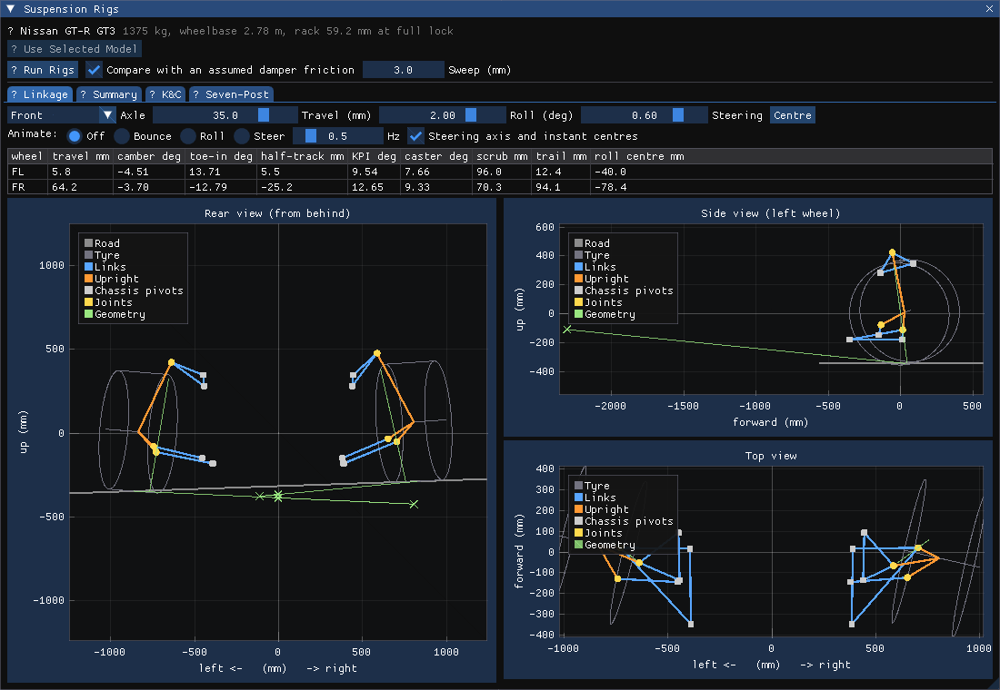
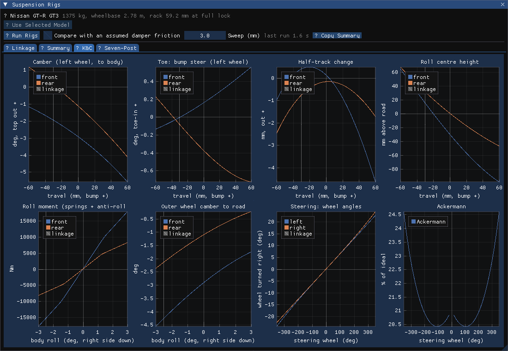
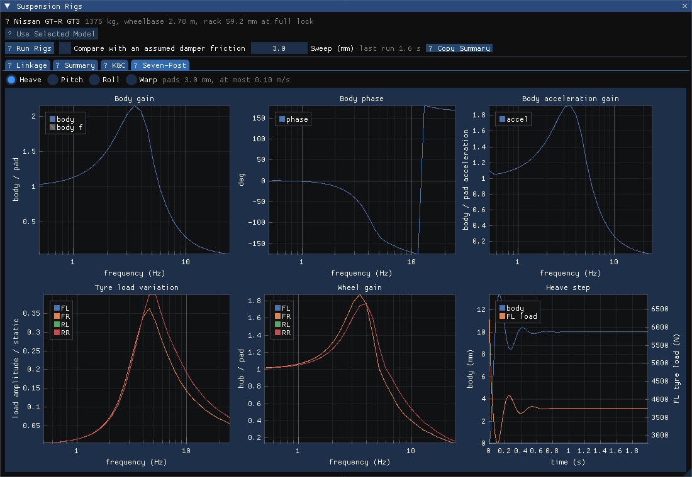

# 编辑器里的悬挂台架窗口（Suspension Rigs）

日期：2026-10-02。状态：已实现，全量 88 项测试通过。台架本身见 [2026-10-02-vehicle-suspension-integration-and-rigs-design.md](2026-10-02-vehicle-suspension-integration-and-rigs-design.md)。

## 0. 结论

- 新窗口 **Suspension Rigs** 把 K&C 和七立柱台架接进编辑器。打开方式有两种：Vehicle 面板的 “Suspension Rigs” 按钮，或 Window 菜单。
- 台架直接用选中模型自带的车辆数据（导入时写进的 `MINIENGINE_vehicle`），不需要 AC 安装目录。
- 窗口有四个页签：
  - **Linkage**：悬挂连杆动画（后视、侧视、俯视）。
  - **Summary**：摘要表。
  - **K&C**：8 张曲线。
  - **Seven-Post**：6 张曲线。
- 曲线用 ImPlot 0.17（vcpkg 新增依赖，MIT 许可，2026-10-02 用户同意），支持缩放、平移、图例开关和悬停读数。

（截图来自无 GPU 的窗口测试：用软件光栅化 ImGui 的绘制数据。测试字体没有图标，所以按钮前显示 “?”；编辑器里显示的是正常图标。）

## 1. 结构

- **报告计算移入库。** `engine/suspension/suspension_rig_report.{h,cpp}`：`RunRigReport(CarModel, RigReportOptions, progress)` 返回一个结构体 `RigReport`，包含 K&C、四个模态的扫频、阶跃、气动、warp、随机路面，以及可选的摩擦对比。另有 `FormatRigSummary`（Markdown）和 `WriteRigReport`（CSV 加 summary.md）。
  - 命令行工具 `miniengine_suspension_rig_report` 改为调用这些函数，GT-R 的数值与之前逐位一致。
- **窗口。** `engine/editor/ui/editor_suspension_rigs.{h,cpp}` 中的 `SuspensionRigWindow`。`EditorUiController` 在窗口第一次显示时才创建它。
  - **车：** 选中实体的模型从 `ModelCache` 取 `carSpec`，经 `BuildCarModel` 得到 `CarModel`。窗口打开后第一次选中的车会自动载入；换车用 “Use Selected Model”。
  - **运行：** “Run Rigs” 在 `std::async` 线程上运行，窗口每帧轮询，显示进度条和当前测试名，可以取消（在两项测试之间停下）。
    - 可选摩擦对比（默认开，时间翻倍），扫频幅值可调。
    - GT-R 全套约 18 s，关掉摩擦对比约一半。
    - “Copy Summary” 把 Markdown 摘要复制到剪贴板。
  - **ImPlot 上下文**与 ImGui 上下文一起，在 `VulkanImGuiLayer` 里创建和销毁。

## 2. Linkage 页签

- **控件：** 轴（前/后）、行程（±60 mm）、车身侧倾（±4°）、方向（−1 到 1，只对前轴）。也可以自动播放：Bounce（±45 mm）、Roll（±3°）或 Steer，频率可调。
- **运动学：**
  - 每帧对该轴左右两个角调用 `Kinematics::Solve`。大幅拖动时按 2 mm 或 1 mm 齿条的步长分段求解，求解器总是从当前位置出发。
  - 侧倾按 K&C 台架的方式：车身侧倾，轮台保持水平，`z = heave − y·sin φ`。所以后视图里看到的是路面倾斜。
  - 某个位置到不了时，显示提示，连杆停在能到的地方。
- **画的内容：**
  - 连杆（蓝）、立柱（橙，从轮心连到各个球铰）、车身铰点（方块）、球铰（圆点）。
  - 轮胎：两个侧壁圆的投影，宽度固定按 0.3 m 画，因为数据里没有胎宽。
  - 路面。
  - 弹簧座点不画：数据给的是轮端刚度，弹簧座只是为输出电机比而虚设的点。
- **几何（可关）：**
  - 主销轴线，画到地面。
  - 后视图：每侧从接地点经前视瞬心连到中心面，交点即侧倾中心。
  - 侧视图：接地点到侧视瞬心的连线。瞬心距离超过 3 m 时只画方向。
- **读数表：** 两轮各自的行程、外倾、前束、半轮距变化、主销内倾、后倾、磨胎半径、拖距、侧倾中心。
- K&C 页签的曲线上用竖线标出 Linkage 当前的行程、侧倾和方向盘角，两边可以对照着看。

**GT-R 前轴的读法（截图中静止状态）。**
- 两侧的前视瞬心都在车的另一侧，离本侧车轮约 1.6 m。两条线在中心面交于路面下方约 23 mm，与 K&C 报告的侧倾中心 −30 mm 一致。差的几毫米是因为外倾使接地点略有偏移。
- 静止读数与 K&C 摘要一致：外倾 −2.92°、主销内倾 9.46°、后倾 7.61°、磨胎半径 89.8 mm、拖距 49.6 mm。

## 3. 曲线页签

- **K&C：**
  - 外倾、前束（bump steer）、半轮距变化、侧倾中心高度，都随行程变化，前后轴叠在一起。
  - 侧倾力矩和外侧轮对地外倾，随侧倾变化。
  - 左右轮转角和阿克曼百分比，随方向盘角变化。阿克曼在两轮转角都小于 1° 时没有定义，曲线在那里断开。
- **Seven-Post：**
  - 模态选 heave、pitch、roll 或 warp。可以叠加摩擦对比的那次运行。
  - 车身增益、相位、加速度增益，横轴是对数频率。
  - 四轮的轮胎载荷波动和轮毂增益。
  - 10 mm heave 阶跃：车身位移和左前轮载荷，双纵轴。

## 4. 验证

- `miniengine_suspension_rig_window_tests`（ctest `miniengine.suspension_rig_window`）的做法：
  - ImGui 和 ImPlot 无头运行，用真实的 `EditorScene` 加 `ModelCache` 里的 GT-R。
  - 窗口自动载入选中的车，Linkage 依次摆出静止、前轴姿态、后轴姿态。
  - 在工作线程上快速跑一遍（30 个扫频周期，3 s 路面，不做摩擦对比，约 1.5 s），再画出每个页签。
- 设置 `MINIENGINE_UI_SNAPSHOT_DIR=<目录>` 时，每个页签会被软件光栅化成 PNG，上面三张截图就是这样来的。
- **修掉的问题：**
  - `RunRoad` 的时长不超过 2 s 的引导段时，统计为 NaN。现在会抛出 `std::invalid_argument`。
  - 阿克曼曲线在中心处有一个掉到 0 的尖刺，现在在那里断开。
- 编辑器以 `--frames 60` 启动并正常退出，ImPlot 上下文的创建和销毁没有问题。

## 5. 局限

- 台架用的是纯数据（`BuildCarModel`），不是 Jolt 整车。整车上的轮胎柔度、簧下质量在 Jolt 里的效果，看驾驶时的 Physics Overlay。
- 胎宽按 0.3 m 画。
- 只支持数据里有双叉臂或麦弗逊连杆的车，AXLE 和 ML 车型不能用。
- 窗口的开关状态不存进 engine settings，每次启动默认关闭。
- 我这边看不到真实的 GPU 窗口，交互（拖动、缩放、播放）需要你在编辑器里确认。

## 6. 补充：场景里的实时七立柱（Live Rig）

用户反馈“场景里的车没动”：只有 Linkage 页签里的连杆在动，视口里的车是静止摆设。所以新增了 **Live Rig** 页签（放在第一个）和 `VehicleRigService`（`engine/editor/services/vehicle_rig_service.*`），结构仿照驾驶模式的 `VehicleDriveService`。

- **启动：** “Put the Selected Car on the Rig” 把选中的车放上七立柱模型（`SevenPostRig`，来自车自带数据，需要簧下质量和轮胎刚度）。启动台架会停掉驾驶，开始驾驶也会停掉台架。关闭窗口时台架停止。
- **输入：**
  - 正弦：模态可选 heave、pitch、roll 或 warp，频率和幅值可调。
  - 扫频：0.5–20 Hz，60 个周期，循环播放。
  - 阶跃：方波。
  - 随机路面：车速可调，有三档粗糙度，左右轮迹独立，后轮按轴距延迟。
  - 正弦和扫频的轮台速度限制在 0.5 m/s 以内（高频时幅值自动减小）。每次切换输入，都在 1 s 内淡入。
- **步进与显示：**
  - 仿真按 1 kHz 步进，“慢动作”设定每秒真实时间推进多少仿真时间（默认 0.25）。
  - “运动放大”只放大画面上的位移（默认 3 倍）。
  - 可以打开假设的减振器摩擦。
- **视口里动的东西：**
  - 车身：heave，pitch、roll 绕簧上质量中心转动，`ApplyTransformMatrix`。
  - 车轮、制动盘、悬挂部件：相对车身的上下位移，`SetSubmeshLocalTransforms`。
  - 场景里按名字找到的道具：`Wheel pad FL/FR/RL/RR` 跟着输入升降；`Aero loader ...` 底部固定、顶部随车身伸缩。
- **曲线：** 最近 10 s（200 Hz 采样），包括轮台和车身（mm，pitch/roll 用右侧纵轴，单位 deg）、四轮轮胎载荷、四轮行程。
- **保存场景：** 用的是台架启动前的位置（`RunWithRigAtStart`），停止时车和道具都还原。
- **验证（`miniengine.suspension_rig_window`）：**
  - 四个检查都通过：
    - 轮台位置与输入一致。
    - roll 时左右轮台反向。
    - 车身往台架算出的方向侧倾。
    - 停止和保存时位置还原。
  - GT-R 在 1.5 Hz、±20 mm 的 roll 输入下，左前轮心比右前高出最多 46 mm（车身侧倾增益约 1.16）。
