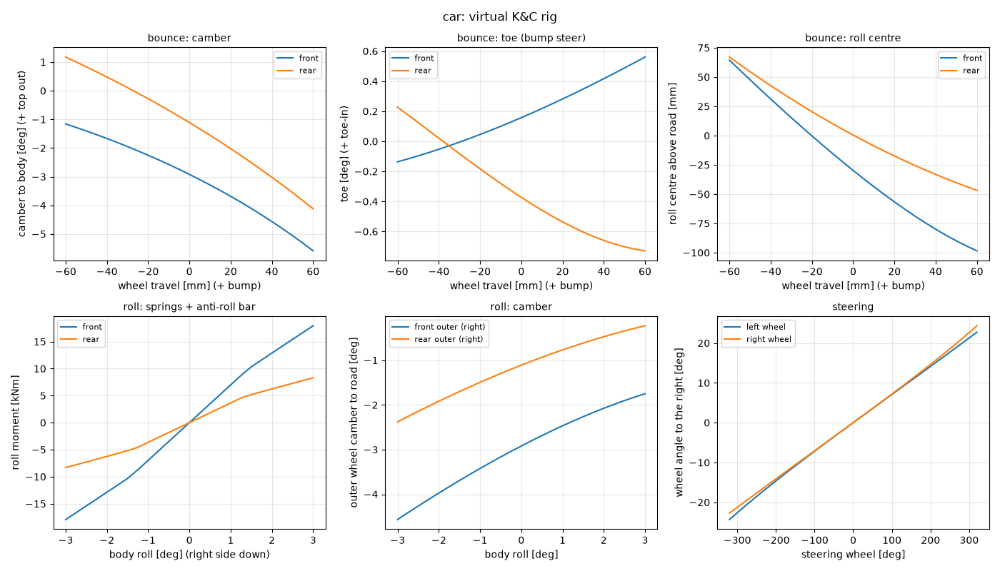
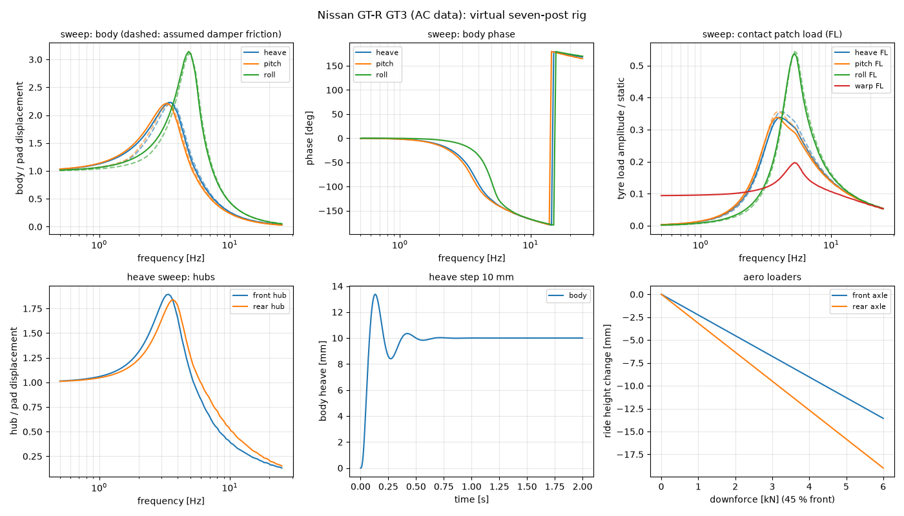

# 多体悬挂接入整车 + 虚拟 K&C / 七立柱台架（GT-R GT3）

日期：2026-10-02。状态：已实现，全量 87 项测试通过；第 7 节（整车簧下质量）为当天晚些时候的补充。悬挂模块本身见 [2026-10-02-generic-suspension-module-design.md](2026-10-02-generic-suspension-module-design.md)；台架规范见 [2026-10-02-suspension-test-rigs-design.md](2026-10-02-suspension-test-rigs-design.md)。

标注约定同前：**[已验证]** = 测试或独立计算核对过；**[未核对]** = 假设，或来源没有核实。

---

## 0. 结论

- 车辆设置里两轴都有 `frontSuspension`/`rearSuspension` 时，整车改用多体悬挂。
  - 车轮的位置、外倾、前束和转向由硬点运动学决定。转向由齿条驱动，阿克曼由几何自然产生。
  - 弹簧、两段式减振器、缓冲块、防倾杆按 AC 的轮端值作用。
  - 轮胎水平力经几何产生抗点头、抗下蹲和顶起效应。
  - Jolt 仍然负责接触、轮胎摩擦和传动。
- 你的 GT-R（`assets/nissan_gtr_gt3`）已带上悬挂数据（原文件备份在 `out/backup/nissan_gtr_gt3.gltf.backup`），在编辑器里开车就会走这套悬挂。
- K&C 台架和七立柱台架在 `engine/suspension/suspension_rigs.*`。`miniengine_suspension_rig_report` 直接从 AC 安装目录读车，一次跑完 GT-R 的全部台架测试（约 10 s），输出 CSV 和摘要；`tools/suspension_rigs/plot_rig_report.py` 画图。

## 1. 接入整车的方法

### 1.1 为什么作用点放在接地点就是对的

连杆无质量，准静态时整个机构把轮胎在接地点 P 处的力系原样传给车身，与几何无关。几何只影响**行程方程**：

```
F_n·(n·∂P/∂z) + F_h·∂P/∂z + M·ω_z + G_弹簧/减振/缓冲块(z, ż) + G_防倾杆 = 0
⇒ F_n = −(G_单元 + G_防倾杆 + F_h·∂P/∂z + M·ω_z) / (n·∂P/∂z)
```

∂P/∂z 是轮架上与接地点重合的那个点、对单位行程的速度。它由运动学的 q_z 和轮架角速度 ω_z 得到（悬挂模块 `CornerOutput::contactPerTravel`）。F_h·∂P/∂z 这一项就是抗点头、抗下蹲和顶起力：制动或驱动时纵向力经 ∂P_x/∂z 抵消（或加剧）弹簧压缩，侧向力经 ∂P_y/∂z（侧倾中心）把车身顶起或拉下。

### 1.2 喂给 Jolt

Jolt 的悬挂是沿接地法向的隐式软约束 `F = k(L_max + preload − L) − c·L̇`，只推不拉，k 和 c 会被除以悬挂方向与法向夹角的余弦（读源码确认）。每个物理步（1 kHz），在 `PhysicsWorld::Update` 里、Jolt 求解之前，对每个轮子：

1. 行程 `z = L_design − L`，L 是 Jolt 上一步的悬挂长度；行程速度用差分。
2. 齿条位移 `u = rackAtLock × 方向盘输入`。rackAtLock 按"内外轮平均转角 = maxSteerAngle"在初始化时用运动学二分求出，符号保证向右打方向是向右转。
3. 上一步的轮胎纵向/横向冲量 ÷ dt，转到悬挂坐标系，作为 F_h。Jolt 施加给车身的是 +λ·e_long，读源码确认。
4. 调用 `SuspensionCorner::Step`（运动学 + 力单元 + 反力），得到 F_n 的目标值和它对 z、ż 的斜率。
5. 写回 Jolt 轮子设置：
   - 刚度与阻尼：`k = −dG/dz ÷ (n·∂P/∂z)`（下限 1000 N/m），`c = −dG/dż ÷ (n·∂P/∂z)`，都乘余弦以抵消 Jolt 的除法。
   - 预载：`preload = (F_n − k·z − c·ż)/k − L_max + L_design`，使 Jolt 的力在当前状态处与目标值及其斜率一致，下一步 Jolt 用自己的隐式求解。
   - `mPosition` 的水平分量 = 运动学轮心的水平位置（轮心横向和纵向位移随行程变化）；垂直分量固定，所以 L 与 z 一一对应。
   - `mWheelForward` / `mWheelUp` 来自运动学车轮轴，包含外倾、前束和转向。Jolt 自己的转向角关掉（`mMaxSteerAngle = 0`），渲染出的轮子姿态自然带上外倾和前束。
6. 防倾杆由我们按 `−k_ARB(z_i − z_对侧)` 显式计算（滞后 1 步），Jolt 自带的防倾杆在多体模式下关闭。
7. 静态预载按重心在两轴间的位置分配，使车静止时停在设计位置（z = 0）。

### 1.3 数据链路

AC `data.acd` 的 `suspensions.ini` / `tyres.ini` / `car.ini`，经 `AcCarData`，进入 `VehicleCarSpec.frontSuspension/rearSuspension`、`wheelbase`、`frontWeightShare`、`inertiaBox`；导入时写入 `MINIENGINE_vehicle`，加载器读回；`ApplyCarSpec` 再把它们放进 `VehicleSettings`，`PhysicsWorld` 据此建立 4 个角。

| AC 字段 | 用途 |
|---|---|
| `TYPE` | DWB → 双叉臂，STRUT → 麦弗逊；其他类型（AXLE、ML）不建模，退回原来的直线弹簧 |
| `WBCAR_*`、`WBTYRE_*`、`STRUT_*` | 硬点。AC 的（向车内、上、前）换成（前、外、上） |
| `STATIC_CAMBER` | 设计车轮轴的外倾 |
| `TOE_OUT` | 拉杆长度改变量。正负号按"正值 = 前束外张"自动判定（`LengthAdjust`，运动学在构造时自行装配） |
| `SPRING_RATE`、`PROGRESSIVE_SPRING_RATE` | 轮端刚度 `F = k z + ½ k_p z²` |
| `DAMP_BUMP/REBOUND` 及其 `FAST_*` 阈值 | 分段线性阻尼曲线（`Curve::Polyline`） |
| `BUMP_STOP_RATE`、`BUMPSTOP_UP` | 压缩限位块；`BUMPSTOP_DN` 用作 Jolt 的最大伸长 |
| `[ARB] FRONT/REAR` | 防倾杆，按每米左右行程差的 N/m 解释 **[未核对：AC 注释写的是 "Nm"]** |
| `HUB_MASS`、`tyres.ini RATE/DAMP/RADIUS`、`BASEY`、`WHEELBASE`、`CG_LOCATION`、`INERTIA` | 七立柱台架用；`HUB_MASS` 与轮胎 `RATE`/`DAMP` 也用于整车的簧下质量（第 7 节） |

AC 的 `ROD_LENGTH`（改变车高）没有用：静态预载直接保证车停在设计位置。

顺带修了一个已有 bug：`STEER_RATIO` 为负时（GT-R 是 −13.6，负号只表示方向）转向锁止角会被丢掉，退回 35°。现在取绝对值，GT-R 为 320/13.6 = 23.5° **[已验证：导入测试]**。

## 2. 整车验证（`vehicle_physics_tests`，GT-R 用 AC 原始数据）

| 测试 | 结果 |
|---|---|
| 静止 | 四轮都在多体模式，行程偏差 0.3 mm（容差 6 mm）；外倾：前 −2.93°、后 −1.12°（数据 −2.9° / −1.1°）；前束：前轴 toe-in、后轴 toe-out（数据符号一致）；渲染的轮子姿态确实带外倾 **[已验证]** |
| 稳态右转（约 15 m/s，方向盘 0.25） | 车向右转；侧倾 0.6°；外侧前轮压缩 10.4 mm、内侧伸长 9.8 mm；外倾：外侧 −3.95°、内侧 −1.85°；从直行起，外轮转 5.71°、内轮转 5.79°（有阿克曼）；后轮只随连杆小幅变化 **[已验证]** |
| 原有的车辆测试（直线弹簧的车） | 全部仍然通过 |

## 3. 台架实现

### 3.1 K&C（`RunKcRig`）

车身固定，车轮平台按指定高度定位，准静态：

- **同向行程**：两轮一起 ±60 mm。输出外倾、前束、半轮距、轴距、平台力（由此得轮端刚度）、主销几何、侧倾中心、接地点和轮心侧视轨迹角。
- **侧倾**：车身 ±3°，平台高度不变，`z_i = −y_i·sin φ`；防倾杆按行程差。输出侧倾力矩（得侧倾刚度）、对地外倾、侧倾转向。
- **转向**：齿条走满行程。输出左右轮转角、阿克曼百分比（相对理想阿克曼）、转向比。
- **抗点头/抗下蹲**：`%anti = tan(轨迹角)·(L/h)·制动或驱动比例`。用的是 Milliken 式的常用构造，原书没读到 **[未核对]**。外置制动器看接地点轨迹，内置驱动看轮心轨迹。

### 3.2 七立柱（`SevenPostRig`）

- **自由度**：车身 heave、pitch、roll，加 4 个簧下质量。
- **轮胎**：弹簧加阻尼，可离开平台。
- **悬挂**：每个角用 `SuspensionCorner`（运动学 + 力单元，可选摩擦），防倾杆按行程差，3 个车身加载器（升力、俯仰力矩、侧倾力矩）。
- **积分**：半隐式 Euler，1 ms。
- **测试项目**：
  - Rill 对数扫频（式 6.56），逐周期一阶谐波提取：车身增益和相位、加速度增益、各轮载荷波动、簧下增益。
  - 阶跃响应：对数衰减求阻尼比。
  - 气动加载。
  - warp 静态测试。
  - 随机路面：Rill 的正弦叠加，左右独立，后轮按轴距延迟。

### 3.3 台架自身的验证（`suspension_tests`）

| 测试 | 结果 |
|---|---|
| Rill 扫频参数（1→2 Hz，4 个周期） | q = 0.2310、q/p = 0.2063、时长 2.9237 s，与书一致 **[已验证]** |
| 七立柱静止 | 车身不动，轮胎载荷之和 = 整车重量 **[已验证]** |
| 七立柱 heave 共振 | 车身 1.84 Hz（1/4 车估算 1.80）；轮跳 11.4 Hz（估算 12.3，低是因为和车身耦合）；半功率阻尼 0.22（估算 0.25） **[已验证]** |
| K&C 侧倾刚度 | 1646.89 Nm/deg，解析值 `(k + 2k_ARB)·t²/2` = 1647.10 **[已验证]** |
| K&C 其他 | 轮端刚度 40.0 N/mm、侧倾中心 86.0 mm、主销内倾 10.5182°，都与单角结果一致 **[已验证]** |

## 4. GT-R GT3 台架结果

数据：`ks_nissan_gtr_gt3`，1375 kg（簧上 1125 kg），轴距 2.78 m，重心 0.28 m，前后双叉臂。





**K&C**

| | 前 | 后 |
|---|---|---|
| 轮端刚度 (N/mm) | 150.6 | 123.8 |
| bump steer (deg/m, toe-in +) | +5.9 | −8.9 |
| 外倾增益 (deg/m, 相对车身) | −35.7 | −43.5 |
| 侧倾中心 (mm) | −30 | 0 |
| 侧倾刚度 (Nm/deg) | 6981 | 3640（前轴占 65.7%） |
| 侧倾转向 (deg/deg, 朝弯外 +) | −0.09 | +0.13 |
| 外侧轮对地外倾 (deg/deg 侧倾) | +0.48 | +0.36 |
| 主销内倾 / 后倾 (deg) | 9.5 / 7.6 | 3.1 / −1.8（后轴是虚拟主销） |
| 磨胎半径 / 主销拖距 (mm) | 90 / 50 | 144 / 26 |
| 接地点侧视轨迹角 (deg) | +6.6 | −22.1 |

转向比 14.1:1（数据 13.6）；满舵阿克曼 25%（左 22.7°、右 24.3°）。抗点头（前）77%，抗抬升（后）133%，抗下蹲（后）8%。后轴的 133% 来自后下臂在侧视里明显倾斜（铰点高度差约 6.5 cm），轮架随行程绕 y 轴转动，接地点后移 0.4 mm/mm。这是 AC 硬点给出的几何，数值偏大，用前值得对照真实车辆核实 **[未核对]**。

**七立柱**（0.5–25 Hz，平台 3 mm，限速 0.1 m/s）

| 模态 | 车身频率 | 峰值增益 | 半功率阻尼 | 轮跳 | 最大载荷波动 |
|---|---|---|---|---|---|
| heave | 3.54 Hz | 2.23 | 0.37 | 无（过阻尼） | 0.39 |
| pitch | 3.27 Hz | 2.21 | 0.36 | 无 | 0.36 |
| roll | 4.83 Hz | 3.14 | 0.23 | 无 | 0.60 |

- heave 10 mm 阶跃：超调 34%，阻尼比 0.34，0.46 s 稳定。
- 6 kN 下压力（45% 在前）：前轴降 13.6 mm、后轴降 19.0 mm。
- warp 10 mm：对角载荷转移 2329 N（233 N/mm）。

几点读法：

- 只按弹簧和轮胎串联估算，车身频率是 2.9 Hz，实测 3.5 Hz 偏高。原因是 AC 的低速阻尼极大（前轴 10600 N·s/m，车身阻尼比约等于 1）：小速度下减振器近乎锁住弹簧，频率被推向只有轮胎时的 5.1 Hz。阶跃中前段的大超调也是这个原因。
- 没有轮跳峰：簧下 59/66 kg 对上这么大的阻尼，簧下模态是过阻尼的。
- 随机路面（50 m/s，12 s）：平滑赛道 Φ0 = 1e-7 m³ 时，载荷 RMS/静载 6%，车身加速度 0.23 m/s²；颠簸路面 Φ0 = 2e-6 时为 26%、1.0 m/s²，没有离地。加入假设的密封摩擦（库仑 60 N、脱离 90 N）后，平滑赛道上车身加速度升到 0.31 m/s²（+34%），颠簸路面只升 6%。也就是说，摩擦在小幅输入下让车变"硬"，这和 Deubel 等人的研究动机一致；摩擦参数本身是假设 **[未核对]**。

## 5. 性能

- 整车：每个轮子每步跑一次 `SuspensionCorner::Step`（约 4 µs），四轮约 16 µs，占 1 ms 物理步的 1.6%。
- 台架：GT-R 全套报告（K&C；4 个模态 × 2 次扫频，各约 51 s 仿真时间；阶跃；气动；warp；2 种路面 × 2 次）共约 9–17 s 墙钟时间。

## 6. 已知局限

1. ~~Jolt 射线轮没有簧下质量和轮胎径向弹簧，整车里看不到轮跳；七立柱台架有。~~ 已补上，见第 7 节。
2. 轮胎水平力和防倾杆都滞后 1 步（1 ms）。
3. 行程速度用差分；Jolt 每步的悬挂长度来自碰撞检测，粗糙路面上会有噪声。
4. 力元在 Jolt 里是在当前状态做线性化，强非线性处（刚碰到缓冲块的那一步）有一步的线性化误差，好在由 Jolt 的隐式求解兜住。
5. AC 的 `ROD_LENGTH`、阻尼器摩擦都没有数据；摩擦默认关闭，只在台架报告里作为假设对比。
6. 只支持 DWB 和 STRUT；AC 的 AXLE（整体桥）和 ML（多连杆）车型仍走原来的直线弹簧。
7. 渲染侧没有改：编辑器里看到的轮子姿态来自 Jolt 的轮子变换，已经带上外倾、前束和转向，但没有在编辑器里目测过（我这边没有图形界面）。

## 7. 补充（2026-10-02 晚）：整车的簧下质量

上面第 6 节第 1 条已解决：数据给了轮毂质量（`HUB_MASS`）和轮胎径向刚度（`tyres.ini RATE`）的轴，整车里每个轮子是一个独立的质量，站在轮胎弹簧上。缺这两项数据的车仍走 1.2 节的无质量做法。GT-R 资产本来就带这两项（59/66 kg，284861 N/m，500 N·s/m），不用重新导入。

### 7.1 方法

每个轮子多一个状态：行程 z 和行程速度 ż（压缩为正），由我们自己积分。方程（`PhysicsWorld::Impl::StepUnsprungCorner`）：

```
m_z·z̈ = F_t·(n·∂P/∂z) + F_h·∂P/∂z + G(z, ż) + G_防倾杆 − m_hub·f·∂W/∂z
m_z = m_hub·|∂W/∂z|²
```

- W 是轮心，P 是接地点。∂W/∂z 是新加的 `CornerOutput::wheelCenterPerTravel`。
- F_t 是轮胎法向力：`k_t·δ + c_t·δ̇`，只推不拉。
  - 变形 δ = (L_design − 接地点随行程的抬升) − L。L 是挂点沿悬挂方向到地面的距离。
  - Jolt 的 L 是上一步开始时测的。挂点在那之后移动过，我们按地面法向把它推到当前位置。地面速度用 Jolt 记录的接触点速度。
- f 是车身在轮毂处的比力（加速度减重力）。加速度用车身速度的一步差分，加上向心项。
- 积分用线性隐式（对弹簧、减振器、防倾杆、轮胎的斜率做后向 Euler）。满压缩和满伸长处是硬限位。

**与 Jolt 的耦合。** Jolt 的车身质量仍是整车质量（含轮毂），车身受两个力：

1. **轮胎力，经 Jolt 的悬挂弹簧。**
   - 刚度固定为 100 N/m，阻尼为 0。每步设预载，使弹簧力正好等于轮毂这一步用的 F_t。
   - 一步内车身移动造成的偏差只有 100 N/m × 位移，可以忽略。
   - Jolt 用同一个 λ 限制轮胎摩擦，所以摩擦的上限是轮胎载荷。
2. **轮毂相对运动的反作用：** `−m_hub·z̈·∂W/∂z`，作用在轮毂处（`AddForce`）。

两者相加，簧上质量受到的正好是悬挂力。验证：在 M·a = F_t − m_hub·z̈ − M·g 里代入轮毂方程，得 m_s·a = F_s − m_s·g。在无质量极限下，方程退化为 1.1 节的平衡式。

**另外两处改动：**

- **螺旋弹簧只推不拉**（`StrutUnitSettings::springPushesOnly`，整车的角都打开）。弹簧在伸长到卸载之后松弛，不再把轮子往上拉。只用 3 mm 输入的台架报告数值完全不变。
- **不在轮毂还在动时休眠。** Jolt 只看车身判断休眠，轮毂速度大于 0.5 mm/s 时重置车身的休眠计时器。不这样做，车会在轮毂还在收敛时睡着，四轮载荷之和停在比车重高 3% 的值上（测试里实际遇到过）。

渲染：`VehicleWheelState` 的 pose 和 `suspensionLength` 改为轮毂的位置，新增 `unsprungMass` 和 `tyreDeflection`。Jolt 的轮子贴着地面，轮毂比它高出轮胎的变形量。

### 7.2 整车验证（GT-R，`vehicle_physics_tests`）

| 测试 | 结果 |
|---|---|
| 静止 | 行程：前左 0.27 mm、后左 0.12 mm。轮胎载荷与变形：前左 3742 N / 13.1 mm，后左 3002 N / 10.5 mm（= 载荷/k_t，容差 0.5 mm）。四轮载荷之和 = 车重（含轮毂），1% 以内 **[已验证]** |
| 静止，轮毂高度 | 349 mm，比 R − δ = 342 mm 高 7 mm。这是 Jolt 圆柱检测带外倾造成的：外倾 2.9°、胎宽 0.33 m 时，胎内缘低约 8 mm **[已验证：容差 12 mm]** |
| 从 0.5 m 落下 | 空中轮胎不受力，轮毂停在弹簧松弛处，约伸长 20 mm。自由落体时轮毂相对车身没有重量，所以够不到 50 mm 的满伸长限位，物理上正确。落地时轮胎载荷峰值 6.0 倍于 1/4 车重，最大压缩 89 mm（前轴硬限位 95 mm），之后回到设计位置 **[已验证]** |
| 2 cm 横向凸块，17.2 m/s | 前轮行程最大 11.7 mm，轮胎载荷最大 3.8 倍静载；车身上下只动了 −10.2 到 +4.5 mm；之后车直行，四轮回到设计位置 **[已验证]** |
| 稳态转向（方向盘 0.25） | 有轮毂：15.5 m/s、0.84 g、侧倾 0.94°。无质量：17.6 m/s、1.02 g、侧倾 0.62°。两次的直线起步完全一样（3 s 后 16.5 和 16.6 m/s），差别来自弯中 **[已验证]** |
| 原有的所有测试 | 都通过。无质量路径保留为单独的测试变体 |

**侧倾的读法。** 加了轮胎弹簧后，每 g 的侧倾从 0.61° 变成 1.12°，约为 1.8 倍。这和串联估算一致：

- 轮胎的侧倾刚度为 `k_t·t²/2` = 6978 Nm/deg（前轴），和前悬挂的 6981 几乎一样。
- 和悬挂串联后，前轴为 3490、后轴为 2399，总侧倾刚度是原来的 1/1.8。
- 前轴分到的侧倾刚度份额也随之下降（只按悬挂算是 66%，串联后约 59%），所以前轴的载荷转移变小、后轴变大。这就是弯中速度更低的原因。

这些是轮胎垂向柔度带来的真实效应，AC 本身也把轮胎当垂向弹簧。

**性能：** 全部车辆测试的时间不变（26.6 → 26.7 s）。每个轮子每步只多一次 1×1 的隐式求解。

### 7.3 仍然存在的局限

1. 轮胎接触仍是 Jolt 的单点（圆柱检测）。轮胎的包络效应（滚过凸块的边缘）、接地印迹长度都没有建模。
2. 车身加速度滞后一步，作为轮毂的惯性项。它与轮毂的耦合是 m_hub/M_等效 ≈ 0.2 的滞后回路，收敛。
3. 轮毂的转动惯量（绕主销、外倾方向）没有算进 m_z。
4. 防倾杆仍取对侧上一步的行程。
5. 落地或刚接触的那一步，轮胎力从 0 开始（Jolt 这一步才发现接触）。
