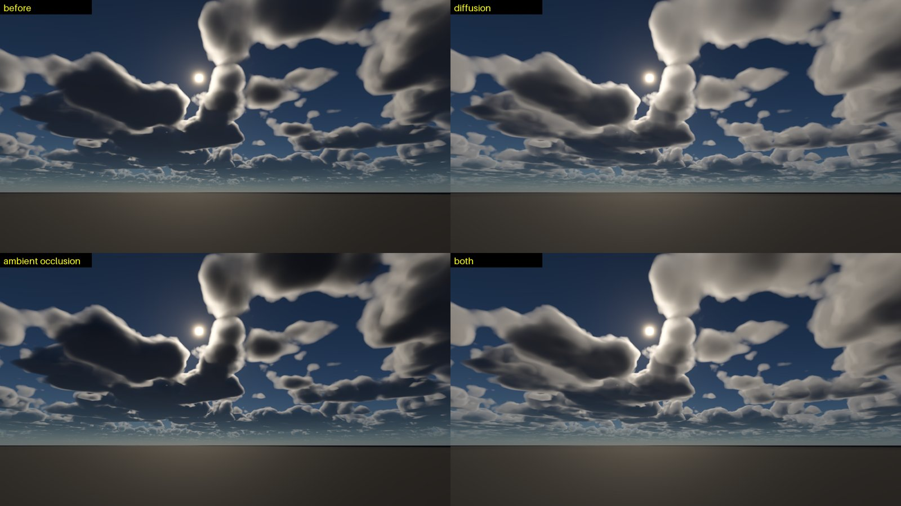
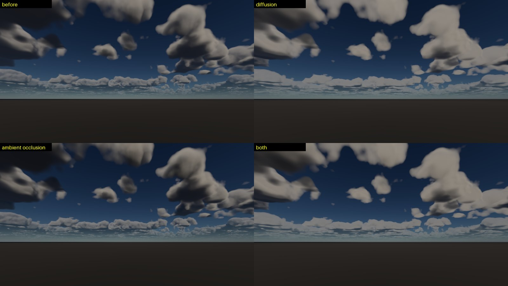

# 云的扩散场与环境光遮蔽

## 目标

对 [2026-09-28-volumetric-clouds-design.md](2026-09-28-volumetric-clouds-design.md) 的光照补两处缺口：

1. **厚云内部过暗。** Wrenninge 八度（a = b = 0.8，5 个八度）最慢的一项按 `exp(-0.41 τ)` 衰减，太阳方向光学深度 τ = 10 时只剩 0.1 %。真实的高反照率水云在 τ ≫ 1 后进入扩散区：光子方向记忆消失，辐射场以慢得多的尺度衰减，云芯和背光面是灰白而不是黑。
2. **环境光无遮蔽。** 原来每一步拿到的天空光和地面光是 `mix(groundBelow, skyAbove, h)`，与头顶、脚下有多少云无关，厚云塔的中部和云底也拿到满天空光。

灵感来自 HPVolumeCloud（HanPi Volume Cloud © AshenOneArt，<https://github.com/AshenOneArt/HPVolumeCloud>）的 phi_fwd 漫射场。没有移植它的代码（它基于 Unity HDRP，部分受 Unity 许可约束），这里从辐射传输重新推导，并用一个不重复计数的组合方式代替它的加性项和 6 个经验参数。

## 1. 扩散场

### 推导

沿太阳光线把云当作一个半无限介质，入射光是准直的太阳光（与 phi_fwd 同样的一维近似）。

- **相似变换**（f = g）：前向尖峰算作未散射，剩余部分各向同性散射。双瓣相函数的平均余弦 `g = (1 - w) g_f + w g_b`（默认 0.47，钳在 [0, 0.95]），
  `τ' = (1 - ω g) τ`，`ω' = (1 - g) ω / (1 - ω g)`。
- **扩散方程**（Eddington，D = 1/3，以 τ' 为单位）：`D φ'' - (1 - ω') φ = -ω' E e^{-τ'}`。
  衰减常数 `κ = sqrt(3 (1 - ω'))`，钳在 0.95 以下（ω' → 2/3 时特解发散；那时扩散近似本身也不成立）。
- **Marshak 边界**（表面没有入射的漫射光）：`φ(0) = 2 D φ'(0)`。解得

```
φ(τ') = 3 ω' E / (1 - κ²) · ( (5/3) / (1 + 2κ/3) · e^{-κ τ'} - e^{-τ'} ),   3 ω' = 3 - κ²
```

  各向同性的散射源是 `φ / 4π`（每球面度、每单位散射系数）。

校验（`tests/volumetric_clouds_tests.cpp` `DiffusionField`）：

- 无损（κ = 0）时表面 φ = 2E，深处趋于 5E，与经典半无限守恒介质的结果一致。
- 在受光表面（τ = 0），单次散射加扩散与八度之和相差不到两倍：向前 2.61 对 2.87，侧向 0.12 对 0.20。这是两种近似在同一处给出的同一份光，说明推导没有数量级错误。
- 默认参数（ω = 0.98，g = 0.47，κ = 0.334）下，τ = 10 时八度剩 0.0012，扩散剩 0.057；τ = 20 时分别是 1e-5 和 0.0097。

### 组合

```
octaves  = CloudSunScattering(τ)                     （原有的八度之和）
diffused = phase(θ) e^{-τ} + φ(τ) / 4π               （单次散射 + 扩散场）
S        = octaves + diffusion · max(diffused - octaves, 0)
```

- 取较大者而不是相加：两者都在近似"被散射过的太阳光"，相加会重复计数。受光表面附近八度更亮，S 就是八度，银边和前向感不变；深处八度衰减完，扩散场接管。
- `diffusion` ∈ [0, 1]，默认 1；为 0 时与改动前逐位相同。
- 反照率用的是场景设置的 0.98。真实水云在可见光的反照率是 0.9999 左右，κ 会更小，云芯更亮；这里不另设参数，交给 Albedo 滑块。

已知局限：与 phi_fwd 一样只沿太阳方向做一维近似，看不见附近的逃逸面（离背光面很近的点会偏亮）；两朵云之间隔着空气时，光学深度被当作连续的，后一朵的扩散场会偏强。

## 2. 环境光遮蔽

每个有密度的步额外做两段不带 detail 的竖直采样（`kCloudAmbientSteps` = 3）：向上到层顶，量出头顶的光学深度 τ_up；向下到层底，量出脚下的 τ_down。

漫射光穿过保守散射的平板，用两流近似的透射率（Bohren 1987）：

```
T(τ) = 1 / (1 + 3/4 (1 - g) τ)
```

它远比 Beer 的 `e^{-τ}` 宽松（g = 0.85、τ = 20 时约 0.31，接近阴天地面拿到的比例），因为天空光在云里被散射后大多还能继续往下走。

```
ambient = mix(groundBelow · mix(1, T(τ_down), ao), skyAbove · mix(1, T(τ_up), ao), h) · ambientScale
```

- 保留原来按高度混合的结构，只把各自被遮挡的那部分削掉：层顶 τ_up ≈ 0、层底 τ_down ≈ 0，两端的外观不变，只有厚云塔的中下部变暗。
- `ambientOcclusion` ∈ [0, 1]，默认 0（见实测）；为 0 时不做竖直采样，与改动前相同。
- 没有用 HPVolumeCloud 的"太阳光学深度 × sin(仰角)"：那个近似在太阳低的时候几乎不遮蔽，而傍晚正是要看的场景。

## 数据

- `CloudSettings::diffusion`（默认 1）、`CloudSettings::ambientOcclusion`（默认 0）；YAML `environment.clouds.diffusion` / `ambient_occlusion`。没有这两个键的旧场景按默认值读入，所以旧场景会直接得到扩散场。
- `EnvironmentUniformData` 由 26 个 vec4 增加到 27 个：在末尾追加 `cloudLighting`（x diffusion，y ambient occlusion，z κ，w 平均余弦）。κ 和平均余弦在 CPU 上（`CloudMeanCosine`、`CloudDiffusionParameters`）按每帧算好。
- 编辑器 Clouds 面板加 "Diffusion"、"Ambient occlusion" 两个滑块。
- C++ 镜像：`CloudDiffuseScattering`、`CloudSunScatteringWithDiffusion`、`CloudDiffuseTransmittance`，与 `volumetric_clouds.glsl` 逐行对应。

## 实测

RTX 4070 Laptop，Release，1280 x 720，空场景（rolling_road 的天空和太阳，去掉实体），云覆盖率 0.55，时钟 7 月 19 日 16:00、北纬 50.4°（太阳仰角约 40°），曝光固定 EV100 15.5。
脚本化运行（`--frames`）不读 miniengine.settings.json 的相机设置、默认开自动曝光，所以曝光要用 `--state` 文件钉住，否则各组之间的差异会被自动曝光抵消。

对比图（左上：改动前；右上：只开扩散；左下：只开遮蔽；右下：两者都开）：




天空区域（画面上 80 %）的显示亮度与改动前之差，三个机位：

| | 平均 | 1 % 分位 | 99 % 分位 | 变化超过 2 % 的像素 |
|---|---|---|---|---|
| 扩散 | +0.057 ~ +0.081 | ≈ 0 | +0.31 | 41 ~ 60 % |
| 遮蔽 | -0.004 ~ -0.008 | -0.023 ~ -0.038 | ≈ 0 | 2 ~ 8 % |

- 扩散只增不减（1 % 分位约为 0），晴空像素不变；云底和背光面从近黑变成灰。
- 遮蔽只减不增，但很弱。原因有两个：原来的 `mix(ground, sky, h)` 本身已经是一种按高度的遮蔽近似（云底主要看到的是很暗的地面，反照率 0.045）；云体内部现在主要由扩散场照亮，环境光占比本来就小。

Forward 阶段（天空在其中绘制）的 GPU 时间，单帧采样：

| | 朝向太阳 | 太阳在身后 | 侧向 |
|---|---|---|---|
| 改动前 | 2.08 ms | 1.92 ms | 2.21 ms |
| 扩散 | 1.84 ms | 1.71 ms | 1.84 ms |
| 遮蔽 | 2.43 ms | 2.17 ms | 2.55 ms |
| 两者 | 2.50 ms | 2.19 ms | 2.65 ms |

扩散的开销在测量噪声之内。遮蔽在 720p 下多 0.25 ~ 0.45 ms（+12 ~ 20 %），按像素数换算到 2913 x 1091 的视口约多 1 ~ 1.5 ms。效果小于 1 %，所以默认关闭，只作为选项保留。

## 后续

- 如果要让遮蔽真正起作用，应当把 `mix(ground, sky, h)` 换成按立体角各占一半的 `(sky · T_up + ground · T_down) / 2`，而不是在旧的近似上再叠一层遮蔽；这会明显改变云底的外观，需要先对照 GT7 的参考图。
- 四分之一分辨率加时间重投影（原设计文档的"Cost"一项）仍然是降开销最有效的一步，做完以后遮蔽的开销也就不成问题了。
