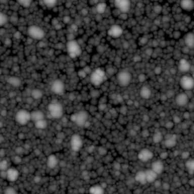
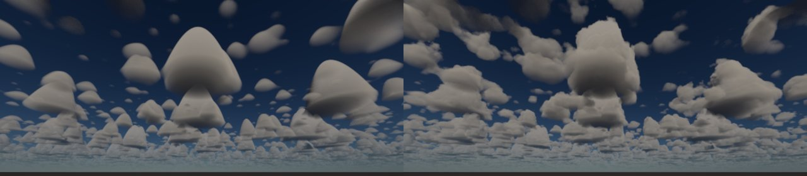
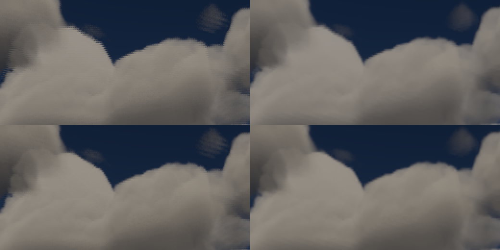
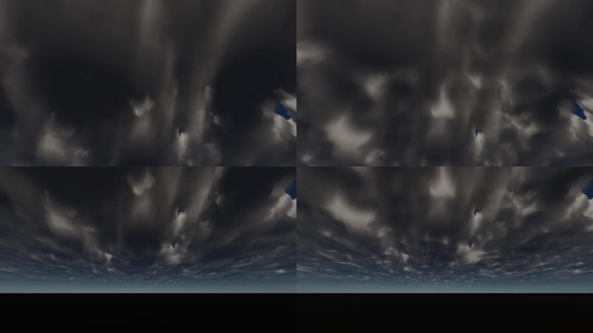
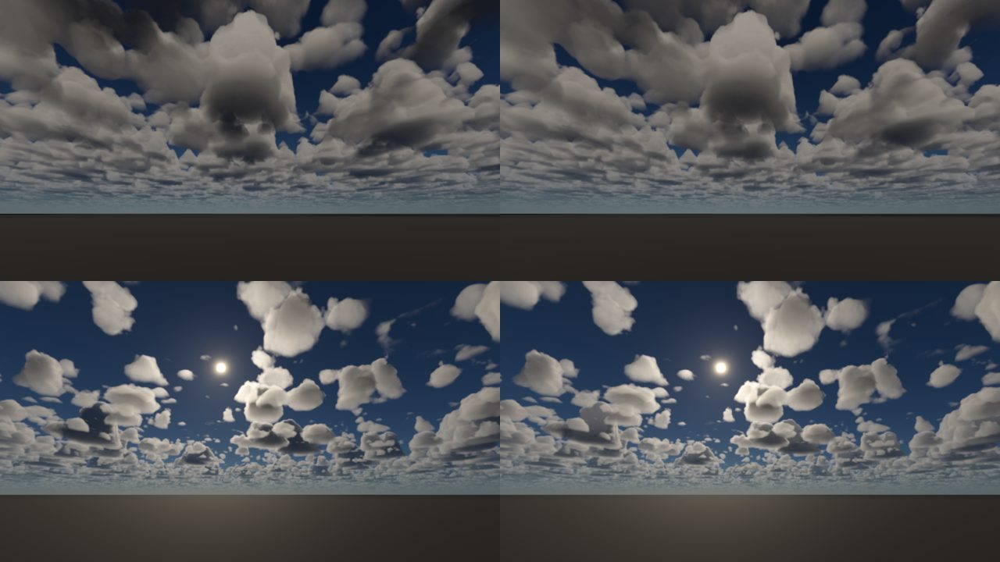
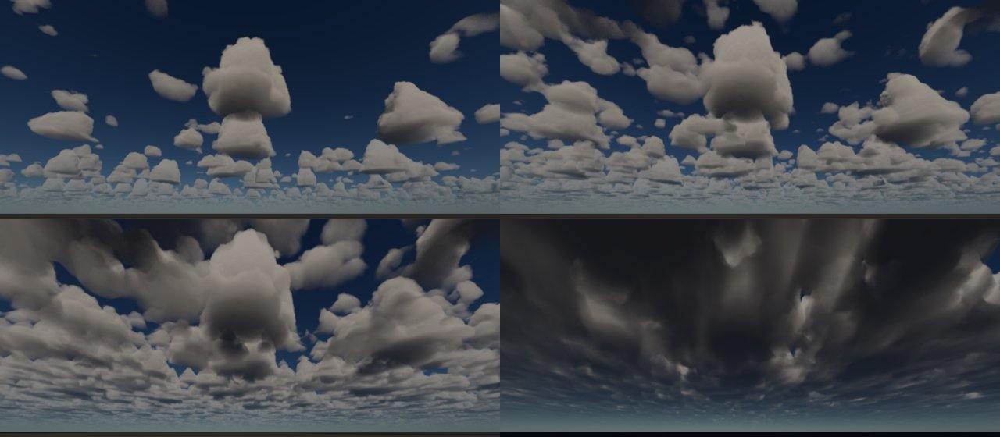

# 积云的生成：羽流图 + 球堆积翻卷 + 半分辨率步进

## 目标

[2026-09-28-volumetric-clouds-design.md](2026-09-28-volumetric-clouds-design.md) 的云形来自 Nubis 式的 Perlin-Worley 噪声：天气图、基础形状和高度剖面混成一个场，再用覆盖率做阈值。它的问题都出在“阈值切噪声”这个做法本身：

1. **没有平底。** 云底只是高度剖面在最低 10 % 内的渐变，看上去是棉团悬浮，不是积云那种平直的凝结高度。
2. **没有云塔。** 场的高低由噪声决定，不存在“一朵云有多高、多宽”这样的量；云顶在整层厚度里均匀分布，没有大小云的层次。
3. **覆盖率不是覆盖率。** 阈值 1 − coverage 对应的是噪声场的分位，与地面被云遮住的比例没有直接关系。
4. **边缘是噪声的等值面。** 侵蚀让边缘发虚，积云应有的锐利菜花边做不出来。

这里改成显式几何：每朵云是一个平底之上的圆顶羽流（2D 羽流图给出顶高和坡度），表面再由两组球堆积体积推进推出（翻卷），密度按到表面的距离给出。光照和步进相应调整，整个步进挪到半分辨率的计算着色器。

命名：工作分支叫 hpvolumecloud-engine-port，但这里没有移植 HPVolumeCloud 的代码（理由见 [2026-10-06-cloud-diffusion-and-ambient-occlusion-design.md](2026-10-06-cloud-diffusion-and-ambient-occlusion-design.md)），云形生成是独立设计的。

## 1. 羽流图（`cloud_weather.comp`）

一张 1024² 的 RG16_UNORM 贴图，铺满一个 40 km 的瓦片（`weather_scale`），启动后生成一次：

- **r**：该处最高羽流的顶高，以云层厚度为单位，存为 `(top − floor) / (1 − floor)`，floor = −0.25。羽流外顶高继续往云底以下降到 floor，这样离开云侧面后表面距离仍然单调下降（步进的空域跳跃依赖这一点）。
- **g**：`|d top / d uv|` / 256，用于把竖直距离换算成垂直于侧面的距离。

8 位精度在 2.5 km 厚度下每级 12 m，会看到台阶，所以用 16 位。

**羽流**：四级抖动网格，每格以一定概率放一个圆顶 `t (1 − (d / r)²)`（抛物面：圆顶，与云底相交处侧面约 63°，在足迹之外继续下降）。

| 级 | 每瓦片格数 | 格宽（40 km 瓦片） | 半径（格） | 高宽比 | 子塔 |
|---|---|---|---|---|---|
| 0 | 16 | 2.5 km | 0.30 ~ 0.45 | 0.45 ~ 0.80 | 3 ~ 5 个 |
| 1 | 32 | 1.25 km | 0.28 ~ 0.45 | 0.40 ~ 0.75 | 3 ~ 5 个 |
| 2 | 64 | 625 m | 0.25 ~ 0.45 | 0.35 ~ 0.70 | 无 |
| 3 | 128 | 312 m | 0.25 ~ 0.45 | 0.30 ~ 0.60 | 无 |

- 尺寸每减半，数量乘四，接近晴天积云场观测到的 D⁻² ~ D⁻³ 幂律。
- 两个大级是“云簇”：核心半径缩到 0.7，周围再放 3 ~ 5 个子塔（半径 0.4 ~ 0.65 倍，高度 0.65 ~ 1.05 倍），读起来是一朵有多个塔顶的云而不是一个圆包。
- 高度 = 高宽比 × 直径 × 16（40 km 瓦片 / 2.5 km 层厚），钳在 1。
- 放置概率乘 `0.4 + 1.2 × cluster`，cluster 是 10 km 和 5 km 两个八度的值噪声：云会成片聚集，不是均匀撒开。
- 圆顶之间用多项式平滑最大值合并，宽度 0.06（2.5 km 层厚下 150 m）。用普通 max 的话，宽矮的子塔和窄高的核心之间会留下台阶，云看上去像叠起来的盘子。坡度按同样的混合权重插值。

C++ 的 `CloudWeatherTexel` 与着色器逐行对应（同一个 pcg3d 哈希），测试直接在 CPU 上量这张图。



## 2. 覆盖率

覆盖率 c 换算成“所有云顶下移多少”：`CloudCoverageOffset(c)`，顶高减去这个量之后高于云底的面积占比就是 c。下移会让每朵云变小、最小的消失；c = 1 时所有顶（包括 floor）都高于云底，云层闭合成一片云盖。

这个映射是在 1024² 的图上实测、再取反得到的 12 个节点（c = 0 时下移 0.70，c = 0.5 时 0.0107，c = 1 时 −0.30），中间线性插值。`CoverageOffsetMatchesTheMap` 用 256² 采样复核：c = 0.05 ~ 0.9 时实际覆盖与目标相差不超过 0.04。

c = 0 时上传的消光为 0（晴空）；否则翻卷还可能在下移后的顶上推出几缕云。

## 3. 表面距离与密度

```
topKm    = (top − offset) × thickness
slopeKm  = slope × thickness × weatherFrequency
distance = min( (topKm − h) / sqrt(1 + slopeKm²), h )          （CloudSurfaceDistance）
```

即到羽流顶的距离（按侧面坡度换算成垂直距离）与到平底的高度 h 取小。正数在云内。

**翻卷**（`CloudBillows`）把这个距离推进推出：

- 两个 128³ 体积（`cloud_noise.comp`）的每个通道都是一个八度的球堆积：每格一个抖动点，取 `sqrt(1 − d²)`（d 为到最近点的距离，以格为单位），从 0.45 拉伸到 [0, 1]。结果是一组圆瓣，瓣与瓣之间有折痕，正是积云的菜花边。拉伸后通道均值 0.69（`kCloudBillowMean`），各八度按均值上下推拉，平均不改变云的大小。
- shape 体积 r g b：每瓦片 4、8、16 个球（7 km 瓦片），推进量为各自球间距的 1/5，是大瓣。detail 体积 r g b a：2、4、8、16 个球（600 m 瓦片），为球间距的 2/5，是大瓣上的小菜花。
- 大瓣从平底的 0 增长到 120 m 以上的全量，所以云底保持平直；小瓣在云底保留 40 %，云底参差但仍然水平。
- `billows`（[0, 2]，默认 1）整体缩放；0 是光滑圆顶，用来单独看羽流的形状。
- detail 随距离在 30 km 内淡出（步长超过小瓣尺寸时只会走样）。

**密度** = `saturate(distance / 15 m)` × `CloudWaterProfile(h)` × density：

- 表面以内 15 m 就到满密度，积云边缘是锐利的。
- 含水量按绝热上升：云底为满值的 25 %，向上按 `(h / 1 km)^(2/3)` 增长，1 km 以上满值。云底因此比云体更透。



## 4. 光照的调整

**向太阳的步进**：7 步，从 25 m 起每步翻倍（覆盖 3.2 km，整层厚度）。前 2 步读小瓣，前 4 步读大瓣，其余（400 m 以上）只读羽流图。原来从 thickness/32 起步的 6 步走不进瓣与瓣之间的折痕，菜花边上看不到明暗。每个视线采样点在步内的位置按像素抖动加黄金比例序列变化：固定取中点时，光滑表面的明暗会被步长切出等高线带，抖动后由 TAA 平均掉。

**扩散场改为有限厚度的板**：原来的扩散场是半无限介质（Eddington + Marshak），对 3 km 高的云塔中心合适，对几百米的小云和靠近背光面的点会高估——光其实从另一面漏出去了。现在沿 −太阳方向再步进 4 步（100 m 起翻倍，只读羽流图），得到光离开云之前还要穿过的光学深度 τ_away，按两面都有 Marshak 边界的无损板求解：

```
φ'' = −3 E e^{−τ'},   φ(0) = (2/3) φ'(0),   φ(T') = −(2/3) φ'(T'),   T' = τ' + τ'_away

φ(τ') = E · ( 5 − 3 e^{−τ'} − (5 − e^{−T'}) (τ' + 2/3) / (T' + 4/3) ) · e^{−κ τ'}
```

- T' → ∞ 时回到半空间的 `5 − 3 e^{−τ'}`：表面 2E，深处 5E。
- 在光离开的那一面降到 `10 / (3 (T' + 4/3))` E；没有云（T' = 0）时为 0。
- 吸收仍由 `e^{−κ τ'}` 乘上去（κ 同扩散设计文档）。这取代了那份文档里带吸收的半空间解。

测试 `DiffusionField` 检查了这几个极限、板内单调下降、以及始终低于半空间解。

## 5. 视线步进

在 `MarchClouds`（`shaders/vulkan/volumetric_clouds.glsl`）中：

- **空域跳跃**：先只读羽流图算表面距离；离表面超过翻卷最大推进量（`CloudBillowReachKm`）就按粗步长前进，不读体积。
- **细步**：可能碰到云时用细步 `15 m + 0.002 × t`（近处 15 m，随距离按像素尺寸增长），锐利的表面才不会被切成条带。
- **距离步进**：在翻卷后的表面之外，按 0.5 × 表面距离前进（这个场的变化最多约为真实距离的两倍，取一半不会越过表面），但不小于细步。
- 迭代次数上限为粗步数的 4 倍。
- 每步的透射按实际步长计算。

## 6. 每帧四分之一像素 + 时间重建（`cloud_march.comp`、`cloud_resolve.comp`）

原来的云在 sky.frag 里逐像素步进；新的步进更贵，所以挪到计算着色器。最初的做法是按场景尺寸的一半步进、sky.frag 双线性放大，TAA 补不回半分辨率丢掉的细节，边缘明显偏软。现在每帧只步进四分之一的像素，但每帧换一个，再由历史重建全分辨率：

- **步进**（`cloud_march.comp`，场景尺寸的一半，向上取整）：每个 2 × 2 块这一帧只步进其中一个像素，顺序 (0,0)、(1,1)、(1,0)、(0,1)（先走对角，两帧就均匀覆盖），四帧轮完。轮换索引由 `VulkanAtmosphere` 自己的计数器给出，与 TAA 是否打开无关。
- **重建**（`cloud_resolve.comp`，场景尺寸）：这一帧步进到的像素取自己的样本，与历史按 0.5 混合（历史先平均掉步进的抖动）。其余像素取上一帧的云重投影过来：方向延伸到这条光线第一次穿过云层那段的中点（与步进照明取的位置相同），用 `prevViewProj` 投影，Catmull-Rom 取样（运动时历史每帧都被重采样，双线性会越来越糊），再夹到这一帧周围 3 × 3 个样本的范围里，所以运动的视角不会拖尾。没有历史时（第一帧、改尺寸后）全部用这一帧样本的双线性插值。
- **未抖动的网格**：TAA 的抖动只是 NDC 上的整体平移，`CloudJitterUv` 用一个点量出它。步进和重建都在未抖动的像素网格上取方向，所以静止视角下历史正好落在自己的像素上，不会被反复重采样。sky.frag 按像素直接 `texelFetch`：在抖动位置双线性读取会把每条边摊开一个像素（试过，锐度回退约一半），而云的边缘本来就有 15 m 的过渡，不需要再抗锯齿。
- **运动时的梳状纹**：重投影每条光线只取一个距离，相机快速平移时视差会差一两个像素，不同帧刷新的相邻像素在边缘排成梳齿（关掉 TAA 时可见）。非新样本按“这一帧移动了多少像素 × 0.125，最多 0.5”向这一帧的插值靠拢；静止时为 0，不影响锐度。
- **固定比例而非曝光**：目标存的是亮度 × 1/64（`CLOUD_TARGET_SCALE`），不再预乘曝光，否则自动曝光一变历史就不对了。朝太阳的亮云约 1e5 cd/m²，仍在 fp16 范围内。
- **资源**：`VulkanAtmosphere` 持有三张 RGBA16F：步进样本（atmosphere 计算集 binding 11）、重建结果（binding 12 存储写入；set 0 binding 28 供 sky 读取）、历史（binding 13 采样读取）。每帧重建后 `vkCmdCopyImage` 把结果复制成下一帧的历史。帧常量（轮换索引、历史是否有效、场景尺寸）用 16 字节 push constant，atmosphere 的管线布局新增这一段，其他 atmosphere 着色器不用它。
- `VulkanRenderer::CreateSwapchainResources` 和 `SyncSceneTargets` 在场景目标重建后调用 `EnsureCloudTarget`；尺寸变化时重建三张图，并用 `VulkanUniformBuffer::SetCloudTarget` 重指每个帧描述符集的 binding 28（此时设备已空闲）。GPU 计时项 “CloudMarch” 和 “CloudResolve”（含复制）。
- 环境探针（`environment_capture.comp`）仍然用 `ApplyClouds` 内联步进（12 ~ 32 步）。它只在环境变化时更新，稳态 0 ms。

边缘（朝太阳，放大 2 倍；左：半分辨率双线性，中：时间重建，右：参考，2560 x 1440 渲染再 2 × 2 平均，即每个输出像素至少一个步进样本）：


天空区域亮度梯度的 99.9 % 分位（越大越锐）：半分辨率 0.144，时间重建 0.183，参考 0.192；99 % 分位 0.090、0.108、0.111。差距收回八成以上。改用双线性读取的版本是 0.171。

运动（相机每帧横移 15 m，约 900 m/s，远超车速，用来放大问题；上：没有运动混合，下：有；左：TAA 关，右：TAA 开）：



没有拖尾。TAA 关时运动混合去掉了大部分梳齿；TAA 开时两者都干净。

开销：重建加复制在 1280 x 720 下约 0.21 ~ 0.25 ms；步进的工作量与半分辨率时相同（同样四分之一的像素）。测量时机器上有其他会话在跑测试和另一个引擎实例（GPU 占用约 70 %），步进的绝对时间不可比，所以这里只给重建的增量。

## 7. 满覆盖：散射光沿自己的云柱下来

### 问题

覆盖率 1 时从下往上看，云底布满指向太阳方位的明暗条纹（下图左）。正午太阳高时条纹变成斑块，关掉扩散或翻卷都不变，所以不是步进问题。

原因在光照的几何：向太阳的光学深度沿斜线取。满覆盖时云层闭合，大部分云柱 0.4 ~ 2.5 km 厚（覆盖率节点：40 % 的面积顶高低于 720 m，10 % 低于 380 m），云底一点朝太阳的斜线会穿过旁边更高的云塔，τ 常在 30 以上。八度项按 `exp(−0.41 τ)` 衰减，原来的扩散场也沿这条斜线取深度，于是云底几乎全黑。只有斜线恰好避开云塔的地方亮，而相邻点的斜线大部分重合，亮暗就沿太阳方位拉成长条。

真实的云盖里，光在 τ ≫ 1 后已经忘了太阳的方向：到达云底的光由这一点自己的云柱多厚决定（平行平面的漫射透射），而不是斜线上碰到了什么。

### 做法

1. **云柱的光学深度。** 羽流图在该点给出云柱顶高 `columnTop = clamp((top − offset) × thickness, 0, thickness)`，含水剖面可以解析积分（`CloudWaterColumn`：云底 a = 0.25 平台到 `H a^{3/2}`，再按 `(3/5) H^{−2/3} h^{5/3}` 上升到 H = 1 km，以上每 km 加 1）。于是上方 `τ_up = σ (C(columnTop) − C(h))`、下方 `τ_down = σ C(h)`，不读任何额外纹理。忽略翻卷和 15 m 边缘，对扩散量级的估计足够。

2. **斜射的平行平面扩散场**（`CloudDiffuseFluence`、`CloudSlabDiffuseScattering`）。把第 4 节的板推广到入射余弦 μ（`φ'' = −3 E e^{−τ/μ}`，两面 Marshak）：

   ```
   B = −( μ(3μ + 2) + (2μ − 3μ²) e^{−T/μ} ) / (T + 4/3)
   φ(τ) = μ(3μ + 2) − 3μ² e^{−τ/μ} + B (τ + 2/3)          （单位入射照度 E）
   ```

   μ = 1 时就是第 4 节沿光线的解；厚板受光面为 2μE，深处为 μ(3μ + 2)E。用 μ0（太阳在该点地平线上的高度余弦）、τ_up、τ_up + τ_down 算出云柱上的扩散场，再乘 `e^{−κ τ'_up}`，与沿光线的扩散场取较大者：光从哪条路扩散进来更容易，就按哪条算。太阳在地平线以下时为 0。

3. **多次散射的八度沿云柱**（`CloudScatteredOpticalDepth`）。第一个八度是单次散射，仍沿斜线，云塔照样投下硬阴影。其余八度（已经散射过的光）取

   ```
   τ_scattered = mix(τ_slant, min(τ_slant, τ_up / max(μ0, 0.1)), deckWeight)
   ```

   `deckWeight = smoothstep(0.6, 1, coverage)`（`CloudDeckWeight`，CPU 上算好放进 `cloudParams.z`）。只在云层闭合时才用：分散的积云不是宽阔的平板，从顶上进来的光会从侧面漏掉，如果在覆盖率 0.45 时也让八度沿云柱下来，背光面会被照亮，积云失去立体感（试过，明显变平）。覆盖率 0.6 以下 deckWeight 为 0，八度与原来完全相同。

### 结果

上：仰视 60°；下：平视 20°。左为改动前，右为改动后，16:00，覆盖率 1：



条纹换成了跟随云柱厚度的块状明暗，云底平均亮度 +20 %（0.166 → 0.201，显示值）。云塔的硬阴影仍在单次散射里。

对其他覆盖率的影响（上：覆盖率 0.75，下：默认 0.45 朝太阳；左改动前，右改动后）：



覆盖率 0.45 只有云柱扩散场起作用，云底和背光面从近黑变成深灰，明暗关系不变。0.75 时 deckWeight 为 0.32，暗核略亮。

测试（`ColumnAndDeck`）：含水积分与数值积分一致；deckWeight 的端点和单调性；`CloudScatteredOpticalDepth` 的取值规则；单次散射仍受硬阴影；μ = 1 的平板等于沿光线的解，厚板的 2μ 和 μ(3μ + 2) 极限；一个 600 m 云柱底部、斜线 τ = 40 的点，云柱扩散场比沿光线的亮 10 倍以上，沿云柱的八度比沿斜线的亮 100 倍以上。

## 数据与兼容

- `CloudSettings::detailErosion` 改名为 `billows`（[0, 2]，默认 1），YAML 键 `billows`；旧场景的 `detail_erosion` 被忽略，按默认值读入。`detailScale` 默认值 900 → 600 m。仓库里的 rolling_road 和 suspension_rig 已改成新键和新默认值。
- 编辑器 Clouds 面板：“Detail scale” → “Billow scale”，“Coverage scale” → “Plume map scale”，“Detail erosion” → “Billows”。
- `EnvironmentUniformData` 大小不变：`cloudLayer.z` 由覆盖率改为 `CloudCoverageOffset(coverage)`，`cloudScales.w` 由侵蚀改为翻卷强度，原来未用的 `cloudParams.z` 放 `CloudDeckWeight(coverage)`。
- set 0 新增 binding 27（羽流图）和 28（重建后的云）；atmosphere 计算集新增 10 ~ 13，管线布局新增 16 字节 push constant（第 6 节）。
- detail 体积由 32³ 扩大到 128³（每通道一个球堆积八度，32³ 装不下每瓦片 16 个球）。
- C++ 镜像（`volumetric_clouds.cpp`）：`CloudWeatherTexel`、`CloudCoverageOffset`、`CloudSurfaceDistance`、`CloudBillows`、`CloudWaterProfile`、`CloudEdgeDensity`、新的 `CloudDiffuseScattering`；旧的 `CloudHeightGradient`、`CloudWeather`、`CloudShape`、`CloudField`、`CloudCoverageRamp` 删除。

## 实测

RTX 4070 Laptop，Release，空场景（rolling_road 的天空和太阳，去掉实体），7 月 19 日 16:00、北纬 50.4°，曝光固定 EV100 15.5，TAA 开，400 帧后截图。


覆盖率（左上 0.2，右上 0.45 默认，左下 0.75，右下 1.0）：



GPU 时间（单帧采样）：

| 1280 x 720 视口 | Clouds（640 x 360） | Forward |
|---|---|---|
| 改动前（云在 sky.frag 内全分辨率步进） | — | 1.92 ~ 2.21 ms |
| 覆盖率 0.2 | 1.40 ms | 0.02 ms |
| 覆盖率 0.45（默认） | 1.77 ~ 1.98 ms | 0.02 ms |
| 覆盖率 0.75 | 2.79 ms | 0.02 ms |
| 覆盖率 1.0 | 3.23 ms | 0.02 ms |
| 覆盖率 0.45，billows 0 | 1.03 ms | 0.02 ms |
| 第 7 节之后：覆盖率 0.45 | 1.72 ms 朝太阳（之前 1.77 ~ 1.98），2.39 ms 背向太阳（之前未测） | 0.02 ms |
| 第 7 节之后：覆盖率 0.75 / 1.0 | 2.65 / 2.95 ms（之前 2.79 / 3.23） | 0.02 ms |

2560 x 1440 视口（Clouds 1280 x 720）下默认设置为 5.1 ms。默认覆盖率下总开销与改动前的全分辨率逐像素步进相当（1.8 ~ 2.0 ms 对 1.9 ~ 2.2 ms，720p）。以上是时间重建（第 6 节）之前的数字；重建另加约 0.2 ms。

验证：`miniengine_volumetric_clouds_tests`、`atmosphere_tests`、`scene_environment_tests` 通过，全部 98 个测试通过；Debug 运行（Vulkan 验证层开）包括一次场景目标重建，没有验证报错。

## 未解决

- 满覆盖时的云塔阴影条纹：已由第 7 节解决。
- 半分辨率的边缘偏软：已由第 6 节的时间重建解决。
- 重投影每条光线只取一个距离；云层很厚、相机又快速平移时，远近两段云的视差不同，重建会稍软。车速下每帧位移不到 1 m，影响很小。
- 环境探针的内联步进在环境变化的那几帧会比原来贵；目前没有单独测量。
