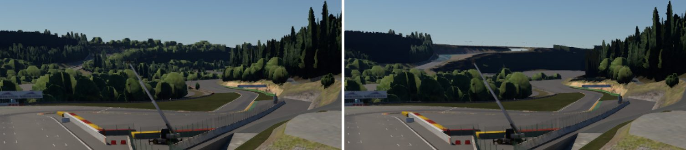
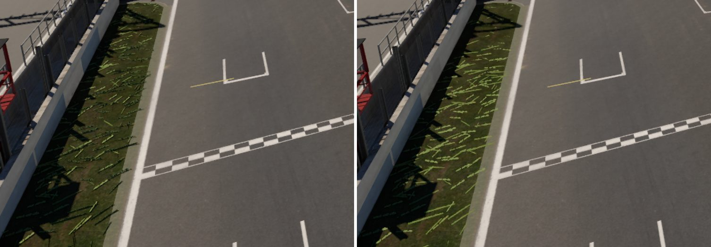

# kn5 Mesh Draw Settings: Shadows and LOD Distances

## Goal

Every kn5 mesh node carries more than geometry: whether it casts shadows, the camera distances it
is drawn between, a World Detail layer, and transparency and depth flags. The reader skipped all of
them, and the importer dropped every mesh with `lodIn > 0` outright. A track was drawn with every
near-LOD mesh at any distance, no far LOD, and everything casting shadows.

## What the files say

Surveyed with a script over the installed content (Spa in detail, then every track and car kn5):

| field | where it is | Spa | all tracks | all cars (main kn5) |
|---|---|---|---|---|
| `castShadows` = 0 | mesh byte 1 | 833 of 1728 meshes, 378 of them drawn (1.19 M of 2.49 M drawn triangles) | 16 041 of 36 937 | 5 874 of 35 226 |
| `lodOut` > 0 | float after `lodIn` | 902 | 24 190 | 2 |
| `lodIn` > 0 | | 181 | 5 412 | 0 |
| `layer` > 0 | uint after the material index | 189 (3D grass 3-5, a few props) | | 0 |
| material `depthMode` = 1 | int after the alpha flags | 4 materials, all blended (painted lines, groove) | | 1 (blended badges) |
| `isTransparent` | mesh byte 3 | matches the material's blend flag on 59 of 89 | | |

`lodOut` = 0 means no limit. That is what every file has; the test fixture's old `1e6` appears
nowhere in real content.

Spa's LODs come in overlapping pairs: `0-25` with `23-250`, `0-200` with `190-350`, `0-450` with
`140-450`, and so on. The 3D grass is split into layers that stop at 90 m (HI), 150 m (MID) and
250 m (LOW). The tree clumps near the track stop at 300-1000 m; the background `treesline` meshes
have no limit.

The non-casters are the ground (asphalt, grass, sand, kerbs), the 3D grass, the guard rails
(`grails`, 82 meshes), the grandstand seats and every far LOD.

## Semantics

- **castShadows**: the mesh casts no shadow. It is still drawn, reflected and seen by GI.
- **lodIn / lodOut**: the mesh is drawn while the camera is at least `lodIn` and less than `lodOut`
  from it (`lodOut` 0 = no limit). CSP's `graphics_adjustments.ini` confirms the game applies them:
  `[LODS] TRACK_DISTANCE_MULT=1` and `TREES_DISTANCE_MULT=1` scale exactly these distances, and
  `BOOST_SPECTATING_TRACK_DISTANCE` raises them for spectator cameras.
- **Distance reference**: the kn5 stores a bounding sphere per mesh, and the usual convention is the
  camera's distance to its centre. No public source confirms what AC itself measures. We use the
  centre of the submesh's bounds, which is the same sphere up to how it was fitted.
- **layer**: the World Detail level (the video setting `WORLD_DETAIL`, 0-5) from which a mesh is
  drawn. Modders split grass into layers 3-5 so the World Detail slider can thin it. At full detail
  (5, the user's setting) every layer draws, which is what the engine does. Not carried.
- **depthMode** 1 (no depth write): it only appears on blended materials, and the engine's Blend
  pipeline already writes no depth. Nothing to do.
- **isTransparent**: duplicates the material's blend flag. Not carried.

## Design

### Import: `MINIENGINE_mesh_draw`

A node extension on drawn mesh nodes, written only when it says something:

```json
"extensions": { "MINIENGINE_mesh_draw": { "castShadows": false, "minDistance": 23, "maxDistance": 250 } }
```

Absent `castShadows` means true; absent distances mean no limit. Far LODs are no longer dropped:
with their range they draw only where the game draws them. `keepVariants` still governs `*_BLUR`,
`*_DAMAGE` and `_HR`/`_LR` twins. The import report and log count both
(`378 meshes cast no shadow, 902 are drawn only within a camera distance range` for Spa).

### Load

`ModelSubmeshData::castShadows` and `drawDistance` (a `DrawDistanceRange {min, max}` in
`engine/asset/mesh.h`). Only the node's own submeshes take the settings, not its children. Values
are read leniently: a wrong type, or a negative or non-finite distance, sets nothing.

### Render

They are carried through `CpuRenderSubmesh` to `RenderSubmesh`.

- **Draw items**: culled by distance from the drawing view's camera to the world-space bounds
  centre, after the frustum test. Every view (viewport, captures, quad recording) uses its own
  camera.
- **Shadow casters** (cascades and local light shadows): none for `castShadows` false. The others
  are culled by distance from the main camera, so an LOD casts only where it is drawn.
- **Selection outline**: the same distance test, so a hidden LOD does not outline.
- **Ray scene**: far LODs (`min > 0`) get `kRayInstanceSkip`, so rays see the near LOD at every
  distance and never both. Non-casters get the new `kRayInstanceNoShadow`. The TLAS mask now has
  one bit each for static/dynamic × caster/non-caster:

  | ray | mask |
  |---|---|
  | probes (`RAY_MASK_PROBE`) | static casters + static non-casters |
  | visibility: reflections, AO, path-tracer bounces (`RAY_MASK_VISIBILITY`) | all four |
  | shadow rays (`RAY_MASK_SHADOW`) | static + dynamic casters |
  | probe shadow rays (`RAY_MASK_PROBE_SHADOW`) | static casters |

  The compute-walk fallback skips by the matching instance flags. Shadow rays are the RT
  sun/local-light shadows, the reflection hit's sun shadow, the path tracer's light rays and the
  DDGI probes' light rays. ReSTIR PT's shared visibility test stays on `RAY_MASK_VISIBILITY`.
- **Ground cover collision** (render meshes of a model without its own collision) skips far LODs.

## Results (Spa, RTX 4070 Laptop, 1600x900, Release)

Grid camera (255, 32, 646), yaw 270, pitch -12. Spa is the selected entity.

| | GPU frame | Geometry | Selection mask |
|---|---|---|---|
| before | 144-147 ms | 47-57 ms | 25-47 ms |
| after | 19-24 ms | 2.2 ms | 0.3-0.8 ms |

From driver eye height at AC_START_0, the best of three alternating runs was 31 ms before and 21 ms
after. Geometry was 5.7 → 1.7 ms. The GPU was shared with another load during these runs, so single
runs vary by 2-3x.

Most of the old cost was the alpha-tested 3D grass, about 1.9 M triangles drawn out to 1.7 km.



From the raised grid camera, the tree clumps around Eau Rouge are past their `lodOut` and are gone.
The background treeline stays. This is what the data says, but it reads bald from up there. CSP's
own answer is a distance multiplier (and a boost for spectator cameras). A future
`track LOD distance` setting would be the place for that.



The 3D grass no longer self-shadows into dark clumps, and the grandstand seats are no longer shaded
by their own steps.

## Tests

- `kn5_import_tests`: the track fixture's road is a near LOD (0-310 m, no shadow) beside a far LOD
  (300 m on). Both import with their settings, the overlap contains both, and the report counts them.
- `gltf_loading_tests::MeshDrawSettingsApply`: values, defaults, lenient parsing, no inheritance.

`asset_browser_window` fails with an ImGui font-merge assertion on unmodified HEAD as well; it is
unrelated to this change.
