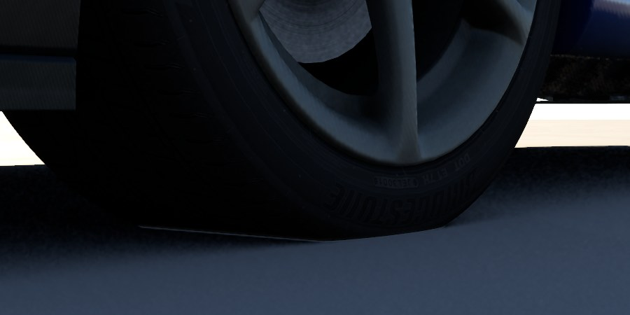
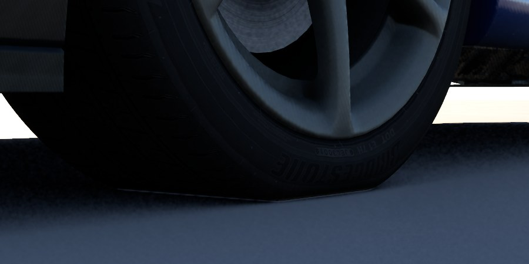

# 轮胎视觉形变

日期：2026-10-08

## 背景

物理上轮胎早就有形变：簧下质量模型里轮胎是一根径向弹簧（`tyreDeflection`），brush 轮胎的胎体相对轮辋有纵向位移、侧向位移和扭转三个自由度（`carcassDeflection`）。但画面上的轮胎网格是刚体，只跟着轮毂中心走，所以车一压下去，整个轮子就按压缩量沉进地面里，接地处既不会压平，侧壁也不会鼓出来。

这次让画面也跟着物理变形：接地处压平，胎侧鼓出，胎体位移带着胎面相对轮辋错开。

| 之前（沉进地面） | 之后（压平 + 胎侧鼓出） |
| --- | --- |
|  |  |

R34 停在平地上，左前轮静态压缩约 12 mm。

## 做法

### 1. 加载时找出轮胎并加密网格（`engine/asset/model_tyre.*`）

- 在 `WHEEL_xx` 节点下的子网格里找轮胎：最外沿要达到车轮半径的 97% 以上（轮辋只到唇边，约 75%），并且最内沿比外沿往里至少 8% 的半径（要有胎侧）。R34 的四条 `Tyre_xx1` 会被认出来，轮辋、Logo 和 Rim_Blur 不会。
- 认出的轮胎记一个 `ModelTyreShape`（中心、轴、胎面半径、胎圈半径、轴向中心和半宽），网格标成 `MeshData::deformable`。
- R34 的轮胎一圈只有 48 段（7.5°）。直接压平的话，接地面的边缘是一条硬折线，于是先按圆周方向细分：每条边按绕轴的角度切到不超过 2°（R34 每条边切成 4 段，1016 → 13844 个顶点）。新顶点放在回转面上（角度、半径、轴向位置分别插值），所以轮胎反而比原来更圆。两个三角形共用的边只生成一次顶点；UV 接缝处位置相同但下标不同的顶点，按位置排序后取同一个端点顺序，保证算出的位置逐位相同，不会出裂缝。

### 2. 形变函数（`engine/renderer/tyre_deformation.*`，着色器 `tyre_deform.comp` 逐行对应）

所有计算都在轮胎网格的静止空间里做。CPU 把地面平面、行进方向和胎体位移从世界空间变换回这个空间，之后车轮自己的变换（滚动、转向、行程）再把形变后的轮胎带到正确位置。这样压平的部分在轮子滚动时始终留在底部。

记顶点到轴的距离为 r，h = (r − 胎圈半径) / (胎面半径 − 胎圈半径)，0 在胎圈，1 在胎面：

- **压平**：顶点沿半径方向往轴里收，收的量刚好让它不在地面以下（除以径向位移对抬高的贡献 cos φ，最小取 0.25）。拐角用 C1 的 smooth max 圆滑过渡，宽度是半径的 1.5%（R34 约 5 mm）。
- **胎侧跟着压**：胎侧顶点再按 h² 乘以其正上方胎面的收缩量往里收，胎圈不动，轮辋就不会和轮胎穿插。
- **胎侧鼓出**：沿轴向往外推，量为 0.4 · sin(πh) 乘以胎面的收缩量，胎侧中部最大，胎圈和胎面处为零。
- **胎体位移**：按 h² 带着 brush 模型的胎体中线移动：前后方向 x_c，侧向是 y_c + θ_c (x − x_c) − y_c Ψ/2 (x − x_c)²（和车辆叠加层画的接地印迹是同一条线），x 截断在接地长度以内。离开接地区后，超过接地半角再转 1.2 rad 的范围内逐渐衰减到零。
- **法线和切线**：对形变函数沿切线方向和垂直切线方向各取半径 1e-3 的差分来求。接地面的法线正对地面，接地边缘的法线连续地从圆弧过渡到平面。

### 3. 渲染接入：复用蒙皮通道

- `MeshData::IsPosed()` = 蒙皮或可形变。凡是 posed 的网格，每个子网格都有自己的一套顶点缓冲、位置缓冲、上一帧位置缓冲和 bind pose 缓冲（`VulkanBuffer::IsPosed`），光追 BLAS 也是动态的，每帧 refit。这些本来是给蒙皮准备的，轮胎直接复用。
- `VulkanSkinningPass` 加了第二条管线 `tyre_deform.comp`，描述符集和 push constant 都与 `skin.comp` 共用（轮胎没有 skin 缓冲，那个绑定位用 bind pose 顶替）。每条轮胎的参数打包成两个 mat4，放进同一个 palette 缓冲。
- 每一帧都会对所有轮胎派发一次：没有形变数据，或者轮子悬空时，就派发一次"静止"参数。这样车停下来后轮胎会恢复原形，上一帧位置也会继续滚动更新，运动矢量是对的。
- 数据流：`VehicleDriveService::Tick` → `BuildTyreDeformations`（每个子网格 2 个矩阵，下标和 submesh local transform 相同）→ `RendererWorld::SetTyreDeformations` → `RenderTransformSnapshot`（和 local transform 在同一时刻捕获，渲染线程只读快照）→ 渲染器的蒙皮派发。
- 剔除包围球额外放大了 0.5 × 胎侧高度 + 5% 半径，给鼓出和胎体位移留出余量。

## 数值

R34 在 rolling road 上以约 21 km/h、半径约 6.5 m 右转（约 0.5 g）时：

| 车轮 | 载荷 N | 径向压缩 mm | 胎体侧移 mm | 扭转 ° |
| --- | --- | --- | --- | --- |
| 左前（外侧） | 5900 | 18.1 | −2.5 | 0.30 |
| 右前 | 2970 | 9.1 | −1.2 | 0.14 |
| 左后（外侧） | 5150 | 15.8 | −1.6 | 0.34 |
| 右后 | 2240 | 6.9 | −0.5 | −0.11 |

能看出来的主要是径向压缩，也就是压平和胎侧鼓出。按 R34 数据算出的胎体很硬，侧移只有几毫米，画面上基本看不出来。这里不做夸大，画面严格跟物理一致。

## 测试

- `miniengine_tyre_deformation_tests`：smooth max 的性质；打包往返；平地上胎面没有任何一点留在地面以下，原本在地面以下的点落在地面上，顶部和胎圈不动，胎侧鼓出量和压缩量都符合公式；接地面法线正对地面，边缘法线不翻转；胎体位移和扭转的方向；细分后点都在回转面上、胎面保持圆形，按位置统计每条边都恰好被两个三角形共用（没有裂缝）；`PrepareModelTyres` 只认轮胎、不认轮辋。
- 截图：`--drive-view fixed` 是新加的命令行选项，驾驶时相机停在 `--state` / `--camera` 给的位置，不跟车，用来拍静止的近景。

## 不做的

- 七柱台（`VehicleRigService`）上的轮胎不变形，因为那里没有地面接触数据。
- 软件光追的 BVH（DDGI 的软件路径）仍然用静止形状，和蒙皮网格的现状一样。
- 胎面花纹和胎侧文字不做局部拉伸校正。
